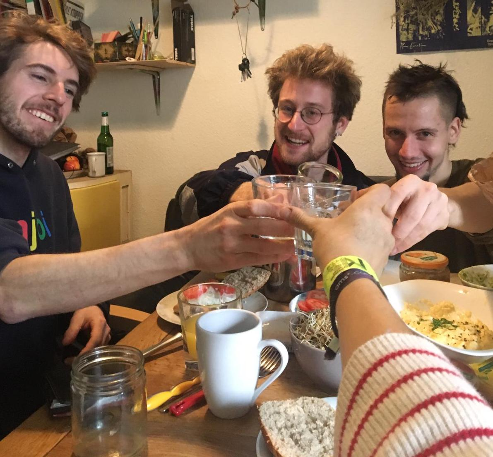
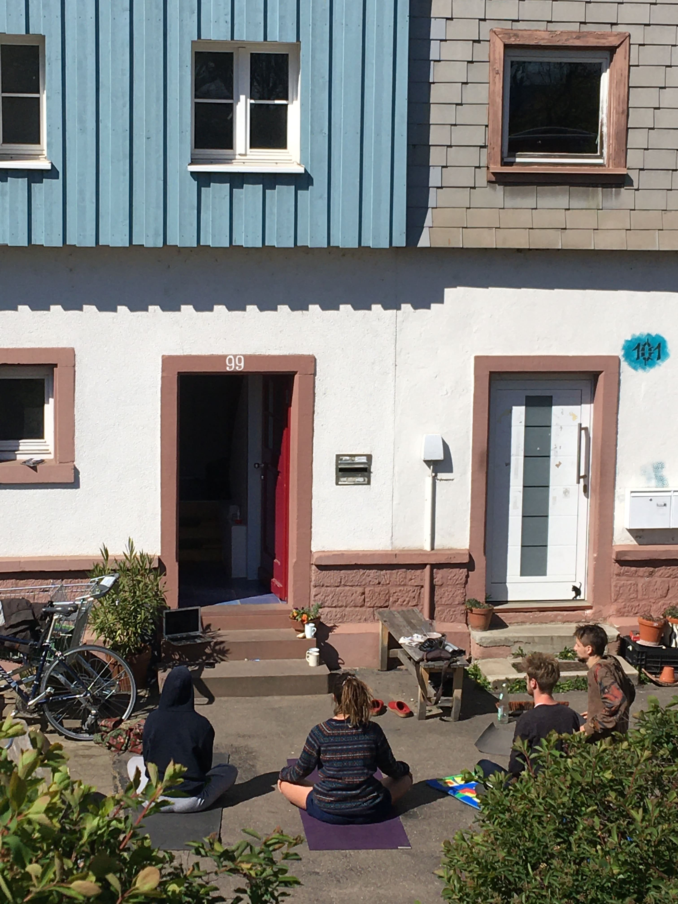

Liebe Freund:Innen, Unterstützer:Innen, Direktkreditgeber:Innen und Interessierte,

hiermit erreicht euch der April-Newsletter der Freiau 99, den wir mit einer guten Nachricht beginnen wollen:

Der Hauskauf ist so gut wie abgeschlossen, der Kaufvertrag ist unterschrieben, die Direktkredite sind auf unser Konto eingegangen und die Bankverhandlungen sind abgeschlossen. Wir warten nur noch darauf, dass die Kaufsumme überwiesen wird. Die Freiau 99 gehört dann also bald offiziell sich selbst, ist dem Markt entzogen und wir sind dann endlich unsere eigenen Vermieter:Innen - auch Dank eurer Hilfe.

Ein letzter Stein auf unserem Weg erreichte uns völlig überraschend Anfang März: In den Plänen der Stadt sind die Freiauhäuser auf unserer Straßenseite seit den 70ern als Gewerbegebiet ausgeschreiben, nicht als Wohnflächen. Dementsprechend stand plötzlich doch noch unser Bankkredit auf der Kippe. Auf einmal waren wir mit fehlenden Dokumenten konfrontiert, die unter den Bomben des zweiten Weltkriegs begraben wurden, und Stadtratsbeschlüssen in altdeutscher Handschrift.

Vor allem durch den vollen Einsatz unser Berater:Innen (danke Wolfgang, Thomas und Helma!) ist dieser letzte Stein aber aus dem Weg geräumt und der Bankvertrag konnte noch rechtzeitig unterschrieben werden.\
So langsam tritt unser Hausprojekt damit in eine neue Phase ein - die Plena werden wieder kürzer, die Arbeit erstmal weniger, nun geht es darum, eine langfristige Struktur zu schaffen.

Ein allerletzter Schritt zum offiziellen Mietshäusersyndikatsprojekt fehlt allerdings noch. Er hätte am 28. März stattfinden sollen. Auf der regionalen Mitgliederversammlung des Syndikats hätte entschieden werden sollen, dass sich das Mietshäusersyndikat in unsere GmbH einkauft.

Dort hätten wir uns gemeinsam vorgestellt und Fragen beantwortet. Aufgrund der Corona-Krise wurde der Termin dann verschoben.

Nichts desto trotz stehen wir nun als (fast) fertiges Hausprojekt in den Startlöchern - und können unsere ersten Erfahrungen schon mit neu entstehenden Projekten teilen. Gerade in den letzten Wochen ist vielen von uns noch einmal klar geworden, wie anders unser Leben jetzt aussehen könnte, wäre die Freiau 99 in die “falschen Hände” gefallen - eine Ausgangssperre in einer Gemeinschaft aus vielen Menschen, in einem Haus, mit dem man in Verbindung steht, ist doch etwas ganz anderes als die völlige Isolation, mit der viele andere Menschen jetzt klarkommen müssen.\
Viel der gewonnenen Zeit fließt jetzt direkt in unser Haus - in den letzten Wochen haben wir den Garten komplett umgekrempelt, Pallettenbänke und einen Zaun gebaut, eine Feuerstelle eingerichtet, Blumen und Gemüse gepflanzt.

Unser (vorerst) letztes Privatkonzert fand übrigens am ersten März statt - wir konnten uns über spanischen und französischen Trap in der 99 freuen.

Den Umständen entsprechend wünschen wir euch allen Gesundheit, Solidarität und einen schönen Frühling - und hoffen, dass sich die Idee weiterverbreitet :)

Liebe Grüße von der Freiau 99

(Jannis, Frans, Viki, Raoul, Elias, Chris, Ludwig, Ines, Laura, Steffi und Mare)

