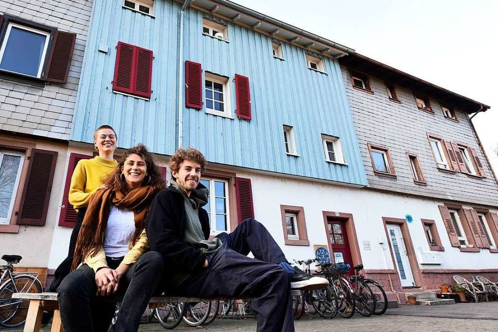

Liebe Unterstützer:Innen und Interessierte,

hiermit erreicht euch der zweite Newsletter aus der Freiau99, mit dem wir euch über unser buntes Treiben auf den neuesten Stand bringen möchten. Wir befinden uns gerade auf der Zielgeraden, das heißt, wir sind motiviert dabei, Direktkreditverträge zu versenden und zu unterschreiben, die Bankverhandlungen abzuschließen und alles weitere zu tun, was zu so einem Hauskauf dazu gehört. Aber eins nach dem anderen:

Falls ihr Anfang Januar unseren [Artikel](https://www.badische-zeitung.de/keine-spekulation-in-der-freiau-99--181020886.html9) in der Badischen Zeitung gelesen habt, habt ihr euch sicherlich gefragt, was aus den, zu dem Zeitpunkt noch fehlenden, 100 000 Euro geworden ist…\
Nun ja, wir waren seitdem fleißig weiter am Werbung machen und auch der Zeitungsartikel hat viel Wirkung gezeigt:\
Kurzum, wir haben inzwischen die Zusagen für die kompletten 300 000 Euro Privatdarlehen! Jedoch können wir uns nicht auf den Zusagen ausruhen, denn damit kann man leider noch kein Haus kaufen.

Da wir mittlerweile nicht mehr nur eine GmbH in Gründung, sondern ins Handelsregister eingetragen sind, können wir uns nun offiziell FREIAU99 GmbH nennen.\
Dank dieser Eintragung konnten wir dann auch endlich die Direktkreditverträge fertig stellen und beginnen, diese an alle interessierten Direktkreditgeber\*innen, welche uns mündlich schon ihre Unterstützung zugesagt hatten, zu versenden. Die ersten Verträge sind unterschrieben zurückgekommen und einige Beträge sind bereits auf das GmbH Konto eingegangen.\
Und es gibt noch eine weitere gute Nachricht: In nicht einmal zwei Wochen haben wir den Termin beim Notar, an dem unsere Geschäftsführung den Kaufvertrag unterschreiben wird!

Es ist toll zu sehen, wie aus der Idee, das Haus zu kaufen und es zu einem Projekt des Mietshäusersyndikats zu machen, langsam etwas Greifbares wird.\
Daher an dieser Stelle noch einmal ein riesengroßes Dankeschön an alle, die uns in Form eines Direktkredites unterstützen und all das ermöglichen!

Liebe Grüße,

die Freiau99\
(Ines, Steffi, Marius, Elias, Viki, Laura, Frans, Jannis, Chris, Raoul, Ludwig)
