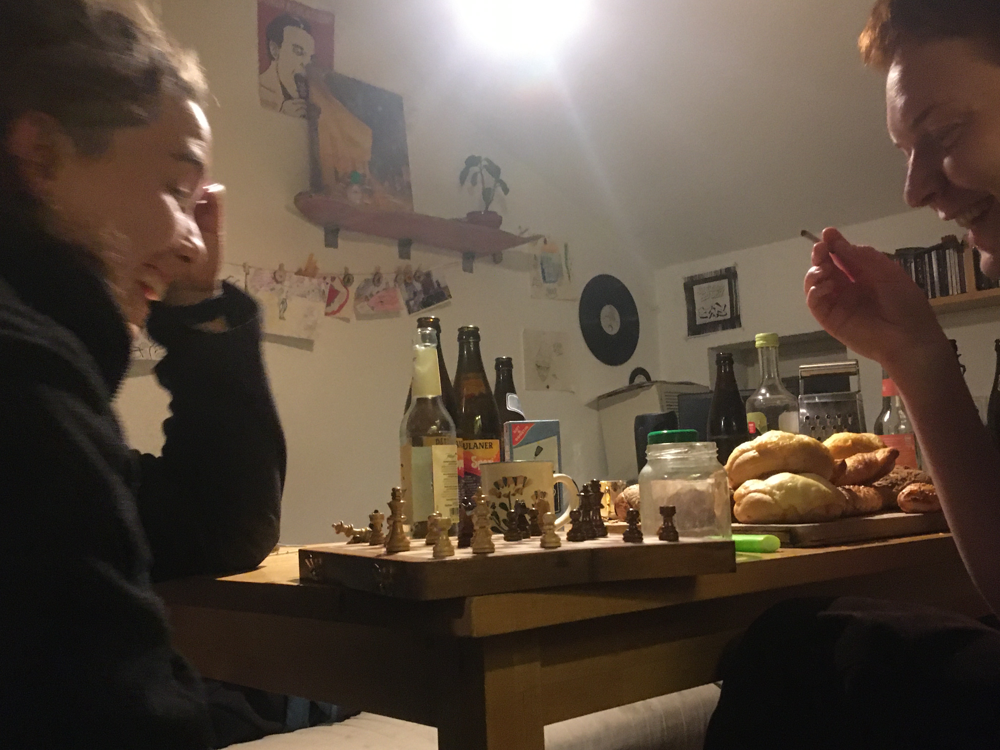

Liebe alle,

nach einer kleinen Funkstille finden wir es angebracht, mal wieder von uns hören zu lassen.

Wir hatten eigentlich gedacht, dieses Jahr von einem sensationellen Fest zum gelungenen Hauskauf, von unserem sensationellen WG-Leben und von sensationellen Ausstellungen, interessanten Vorträgen und Partys in unserem Keller berichten zu können.

Doch die letzte Zeit verlief eher sensationell ruhig und unsere sozialen Kontakte sind auf ein Minimum reduziert, 1.5 Meter entfernt und oft maskiert.

Nun ja. Jammern, wie es hätte sein können, ist ja bekanntlich nicht das Rezept zum Glück. Und ich glaube, wir haben es auch jetzt im 2. Lockdown geschafft, eine recht gemütliche Zeit in der Freiau99 zu verbringen. So hat beispielsweise die Ausgangssperre ab 20 Uhr, die in Baden-Württemberg derzeit gilt, dazu geführt, dass wir als WG schöne gemeinsame Koch-Abende verbracht haben. Außerdem vergeht kaum ein Abend, an dem nicht die ein oder andere Schach-Partie in unserer Küche ausgetragen wird.

Neben der Anpassung an die Pandemie gibt es aber auch andere Veränderungen in unserem Haus. So heißen wir zwei neue Mitbewohnerinnen willkommen, die im Herbst/Winter eingezogen sind: Finja und Lui, beim Schachspielen auf Foto im Anhang. Die beiden ersetzen Steffi und Ines, die nun zwar nicht mehr in der Freiau99 wohnen, dem Haus weiterhin als Vereinsmitglieder und Freundinnen erhalten bleiben.

Finja hat uns als erste Amtshandlung beim „Aufstrich-Syndikat“ angemeldet, wo verschiedene Freiburger WGs vegane Brotaufstriche selber machen und unter einander austauschen. Und Lui wird ab 2021 die Öffentlichkeits-AG unterstützen, das heißt von der werdet ihr in Zukunft vermutlich noch häufiger was hören.

\
Aber nicht nur bei uns im Hausprojekt gibt es Veränderung, auch in Freiburg selbst tut sich etwas: Gerade während der Pandemie-Zeit entstehen auch einige neue sympathische Hausprojekte, denen wir viel Erfolg auf ihrem Weg wünschen. Wenn jemand von euch Interesse hat, weitere Hausprojekte in Freiburg zu unterstützen oder sich einfach informieren will, hier findet ihr weitere Infos:\
[ma per tutti](https://mapertutti.org/) – Landnahme an der Oase \
[Stühlinger27](https://stuehlinger27.org/) – Mieter_innen-Initiative im Mietshäuser Syndikat \
[k.neun](https://kneun.org/)- Wohnprojekt Freiburg

Nun gegen Jahresende haben wir passend zur besinnlichen Weihnachtszeit auch noch ein paar spaßige Aktivitäten vor uns, die auf uns warten: 1. unsere erste Steuererklärung schreiben und 2. die Zinsen für die Direktkredite berechnen, überweisen und eure Kontoauszüge anzufertigen und versenden.

Naja, ein Hausprojekt ist dann eben doch nicht nur Irokesen und Dosenbier, sondern auch Excelltabellen und Buchhaltung.

So viel zu uns. Wir wünschen Euch allen schöne Weihnachtstage im kleinen Kreis und einen guten Start ins Neue Jahr. Wir hoffen, dass ihr alle gesund bleibt und dass all die schönen Treffen und Feten, die geplant waren, so bald wie möglich nachgeholt werden können.

Danke noch einmal für euer Interesse und eure Unterstützung! Wir sind gespannt, was 2021 für uns alle bereit hält.

Beste Grüße, Elias im Namen der Freiau99
