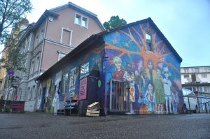

Liebe alle,

bevor sich das Jahr dem Ende neigt, wollten wir noch einmal von uns hören lassen.

Obwohl für die meisten von uns die letzten Wochen von Uni- oder Arbeitsstress geprägt waren, konnten wir als Hausgemeinschaft noch einige schöne Abende miteinander verbringen. Darunter auch ein Weihnachtsessen, bei dem es nicht nur hausgemachten Spätzle-Schmaus gab, sondern auch eine Schrottwichtel-Runde. Für Letztere wurde mal wieder in den Tiefen von Freiburgs Verschenkekisten gewühlt und dabei so Schätze wie ein blinkender Einhornstab oder eine kuriose Holzschnecke gefunden (zu erwähnen sei auch Elias kreativer Einfall eine Schraube zu zersägen, um der Wichtelregel „Es darf nichts praktisches sein.“ zu entsprechen). Und während dicke, schneeverheißende Wolken über Freiburg schweben, Elias Geburtstagsgeschenk (ein Schlitten) zu Ausflügen ruft und der Plattenspieler drinnen im Warmen seine allabendlichen Runden dreht, freut sich der neulich präparierte Garten auf seinen Einsatz mit Kraut und Gemüse im Frühjahr.

Leider gibt es zum Jahresende auch nochmal unschöne News. Nachdem im Sommer bereits der Bis Späti schließen musste, sind Ende November mit dem kleinen Häuschen in der Gartenstraße 19 und der BikeKitchen erneut autonome, selbstorganisierte Räume platt gemacht worden. Elf Jahren Besetzungsgeschichte wurden damit ein Ende gesetzt.

Daher steht auf unserer Wunschliste weiterhin: "Die Häuser denen die drin wohnen." (Und ein paar mehr nicht-kommerzielle Freiräume in Freiburg wären auch nicht schlecht).

In diesem Sinne, an alle die feiern: Schöne Weihnachten und einen langen Rutsch.

Auf bald!

Luka und Lui aus der Freiau99
