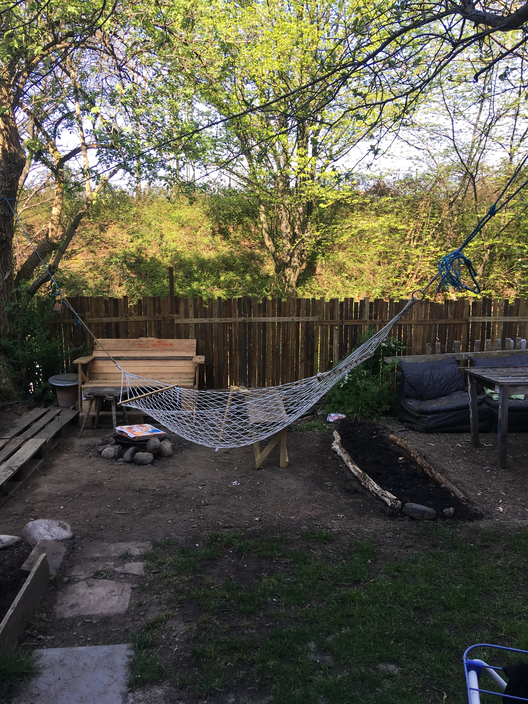

Liebe alle,

erstmal gibt es tolle Neuigkeiten: Am Samstag, den 13.03. hatten wir die Gelegenheit uns als Projekt in der Mitgliederversammlung des Mietshäusersyndikats vorzustellen, um über unseren Beteiligungsbeschluss zu entscheiden (zuvor musste dies aufgrund Corona leider verschoben werden). Mit viel positivem Feedback wurde dem Beteiligungsbeschluss zugestimmt, juhu!

Jetzt ist das Syndikat Mitgesellschafterin unseres Projekts, wodurch die Freiau99 dauerhaft dem Immobilienmarkt entzogen ist. Wir freuen uns jetzt drauf, uns in verschiedenen Arbeitsgruppen stärker im Syndikat zu beteiligen und unseren Teil zu dessen Aufrechterhaltung beizutragen.

Ein weiterer Erfolg ist die Fertigstellung unseres ersten Jahresabschlusses als Hausprojekt. Hier geht unser Dank an Jannis und Steffi, die sich über viele Stunden hinweg damit auseinandergesetzt haben. Zudem gratulieren wir Elias, der Viktoria in der Geschäftsführung ablöst.

Da wir ja zurzeit selbst keine Veranstaltungen durchführen können, möchten wir euch im Folgenden ein paar Projekte vorstellen, die wir unterstützenswert finden.\
Kennt Ihr schon das Delphi-Space? Das Delphi ist ein Raum für Ausstellungen, Vorträge, Lesungen und künstlerische Projekte in der Beurbarung, Freiburg. Natürlich kann auch dieser Raum aufgrund der Corona-Krise seine Türen momentan nicht öffnen. Jedoch sucht das Delphi derzeit Mitglieder für den DELPHI Verein, damit dieser sich für Förderungen bewerben kann. Dabei geht es primär um Mitglieder - wer trotzdem etwas spenden möchte, kann dies natürlich jederzeit tun. Falls Ihr selbst interessiert seid oder jemanden kennt, der einen kulturellen Raum unterstützen möchte, schreibt dem Delphi gern eine Mail unter [info\@delphi-space.com](mailto:info@delphi-space.com). Ihr wisst ja: Ohne Kunst wird’s still…

Ein weiterer toller Zusammenschluss ist der Förderverein Emanzipation & Frieden (kurz Emafrie). Dieser organisiert Veranstaltungen, macht Radiosendungen und schreibt Texte & Flugschriften zu politischen Themen wie Antikapitalismus, Antisemitismus uvm. Am 22. April organisiert die Emafrie einen Vortrag über das Mietshäusersyndikat, wobei ein Film, den wir über die Freiau99 gedreht haben, exemplarisch als Hausprojekt vorgestellt werden soll. Weitere Infos gibt’s hier: <http://emafrie.de/>

Endlich, der Frühling kommt! (wenn auch schleichend…)\
Wir freuen uns sehr darauf, bald wieder die Hände in die Erde zu stecken und den Garten mit Gemüse, Kräutern und Blumen zu bepflanzen. Ein paar Einkäufe wurden schon gemacht, sodass wir mit dem Vorziehen beginnen können. Hoffentlich lässt bald auch die Pandemie zu, dass wieder mehr Leben in unserem Garten einkehrt und dieser zum gemeinschaftlichen Treffpunkt werden kann.

Das war’s auch schon wieder von uns. Zum Schluss nochmal ein dickes Dankeschön an alle Unterstützende des Hausprojekts! Falls ihr noch Personen kennt, die Interesse haben könnten, ihr Geld bei uns anstatt bei der Bank zu hinterlegen: Spread the word!

Liebste Grüße und bis bald,\
Lui von der Freiau99

