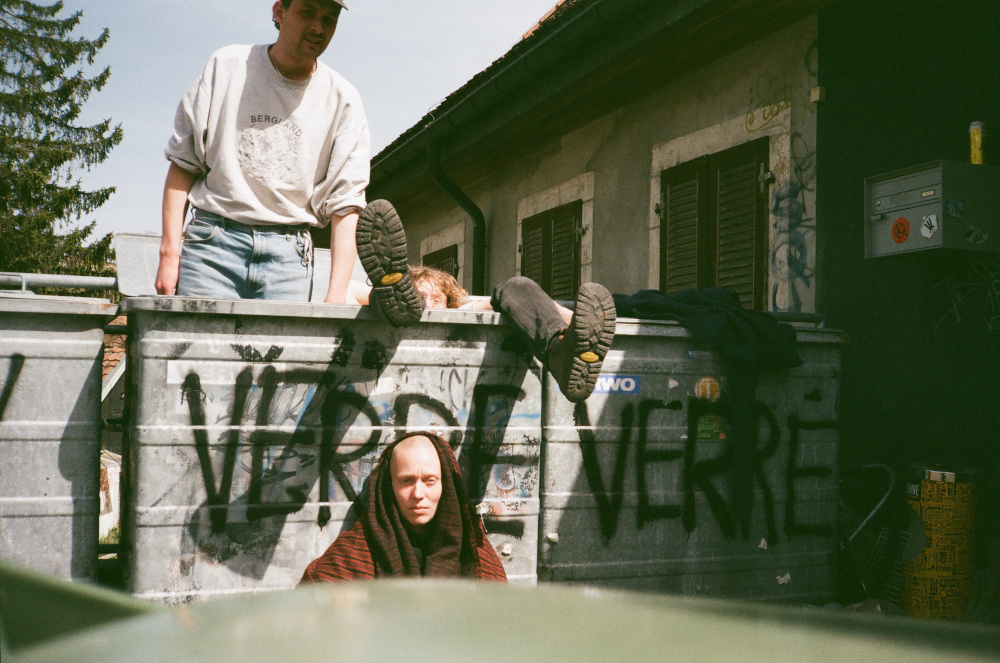
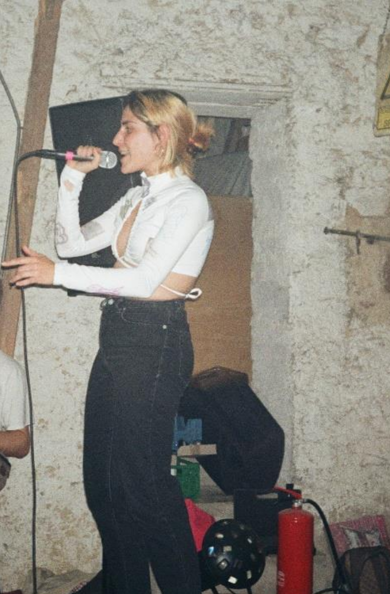

Liebe alle,

der Herbst hat den Sommer nun endgültig abgelöst und die Bewohner:Innen der Freiau sind wieder aus ihren Urlauben zurückgekehrt. Trotz einiger ruhigerer Phasen über den Sommer ist so Manches passiert in der 99. Leider haben wir uns von Finja verabschieden müssen, die nun in ihrem ausgebauten Bus ein neues Zuhause gefunden hat. Gleichzeitig freuen wir uns, dass Magdalena seit Juni das Projekt und unser Zusammenleben bereichert. Auch Frans ist für sein Studium für ein paar Monate in das - zum Glück - nicht so weit entfernte Mulhouse gezogen. Zur Zwischenmiete wird nun Luka bei uns wohnen. Endlich konnten wir den Keller wieder als Raum für Kunst und Kultur einweihen. Nachdem dieser über das letzte Jahr eher als Abstellraum diente, konnten wir diesen – nach einer kleinen Aufräumaktion – endlich wieder mit Menschen und Musik füllen. Für bereits zwei Konzerte konnte der Keller dienen. Ende September waren Facci OG, mit ihrem neu veröffentlichten Album, und die Jungs von Gönnermusik79 am Start. Letzte Woche Sonntag folgte dann ein Konzert von der Band Omni Selassi, organisiert durch das Freiburger Kollektiv Seafoodshows.

Wir drücken beide Daumen, dass die pandemische Lage auch über den Winter entspannt bleibt, sodass wir uns den Keller warmhalten können. Auch unseren Hof haben wir mal wieder ein bisschen rausgeputzt, um in den kommenden Wochen dort einen Flohmarkt inklusive Glühweinausschank zu veranstalten. Den genauen Termin werden wir noch verkünden; vielleicht sieht man sich ja dort auf ein warmes Tässchen?

Nach längerem Vorhaben haben wir nun endlich ein Banner für unsere Hauswand geschrieben, der in Kürze aufgehängt wird. Diesen wollen wir in Zukunft auch immer mal wieder wechseln, da wir ja glücklicherweise unsere Hauswand frei gestalten können und an einer großen Straße zu wohnen immerhin den Vorteil bietet, viele Menschen zu erreichen. Wenn ihr also noch Ideen für Sprüche oder Infos habt, die man auf ein Banner packen könnte, schreibt uns gerne.

Das wars auch schon wieder von uns. Wir hoffen ihr habt einen gemütlichen Start in die kalte Jahreszeit und erneut ein dickes Danke für eure Unterstützung! Wenn ihr noch Menschen in eurem Bekanntenkreis kennt, die Interesse an der Unterstützung eines Hausprojektes haben könnten, lasst sie gern von uns wissen. Wir freuen uns weiterhin über Direktkredite.

Liebste Grüße und bis dahin, Lui aus der Freiau99
