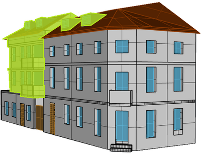

Liebe alle,\
\
bevor wir euch über Neues aus der 99 berichten, wollen wir erstmal kurz Werbung für ein anderes Projekt machen:\
In der Adlerstraße 2, Teil des Grüns, wird über dem seit zwanzig Jahren existierenden, soziokulturellen Ladenprojekt KYOSK, ein neues Syndikatshaus entstehen, die Resysdenz/ A2.

\

Das Projekt hat eine vom Freiburger Stadtbau veranstaltete Konzeptvergabe für sich entschieden und plant nun mit dem Haus und einem neuen Überbau von mindestens zwei Stockwerken, die Schaffung von neuem, bezahlbaren Wohnraum. Dieser Raum soll im gesamten Projekt 40% unter der ortsüblichen Vergleichsmiete bleiben und somit den unteren Einkommensklassen zur Verfügung stehen. Bei der Sanierung des Eckhauses stehen besonders die Faktoren Energieeffizienz und Ökologie im Vordergrund. Leitgedanke der Resysdenz ist die bewegende und immer mehr an Bedeutung gewinnende Frage: Was braucht unser Kiez und wohin wollen wir zukünftige Entwicklungen mitwirkend hintreiben? Wir finden die Pläne der Resysdenz klasse! Da das Projekt allerdings noch in jungen Schuhen steht, braucht sie dringend Unterstützung. Also verbreitet gerne die frohe Botschaft! Mehr Infos zu der Resysdenz findet ihr unter [https://resysdenz.org](https://resysdenz.org/).\

\
Nun zu uns:\
Wie jedes Jahr versuchen wir unsere grünen Däumchen in den Garten zu stecken und es uns noch ein bisschen gemütlicher zu machen. Dieses Jahr hat sich dafür auch eine eigene AG formiert, die das Ganze ein bisschen mehr vorantreibt. Neben einem frischen Kräuterbeet wurden sowohl im Garten als auch vorm Haus verschiedene Blumen eingepflanzt, um die Artenvielfalt der Insekten zu fördern. Auch eine neue Feuerstelle und eine Überdachung zur Holzlagerung sind geplant. Neben dem Garten haben wir uns erneut dem Keller gewidmet. Nach mehreren Aufräum- und Sperrmüllaktionen haben wir jetzt wieder Raum für Konzerte und Co. Auch die Betonierung des Bodens ist geplant, damit alle ordentlich ihr Tanzbein schwingen können, ohne am nächsten Morgen mit staubigen Nasen aufzuwachen.\
\
War da nicht was mit einem Banner? Achja… wie im letzten Newsletter angekündigt, hatten wir ein Banner gemalt, um die Präsenz von Syndikatshäusern zu stärken - wozu sich die viel befahrene und begangene Straße vor unserem Haus ja gut eignet. Die Banner-Konstruktion hing dann auch genau einen Tag lang, bis der Wind kräftig dagegen pustete und uns unsere Handwerkskünste im Stich ließen – wodurch das Banner eher einem Damokles-Schwert glich. Jetzt haben wir uns dazu entschieden, ein richtiges Banner drucken zu lassen, damit das Ganze auch ein paar Jährchen hält. Schon bald wird dieses unsere Hauswand zieren, also haltet die Augen offen!\
\
Wir beziehen bald richtigen Ökostrom! Obwohl wir diesen auch bei unserem bisherigen Anbieter Badenova bezogen haben, war das leider mal wieder eher grün gewaschener. Denn obwohl Badenova sich als “Energieversorger für Ökostrom und Biogas” darstellt, ist die Hauptbezugsquelle (Stand 2020) weiterhin Erdgas, während die Grünstromproduktion lediglich 3% (93GWh von insgesamt 3120 GWh) beträgt. Auch wurden 38.1 Mio € in Erdgas investiert, während lediglich 0.2 Mio € in Biogas investiert wurde (Quelle: <https://extinctionrebellion.de/og/freiburg/1rueckschau/aktion-gegen-greenwashing-freiburg-badenova-das-erdgas/>; Geschätsbericht Badenova 2020). Unseren neuen Vertrag haben wir mit Polarstern abgeschlossen – ein Unternehmen, welches unabhängig von allen großen Energieversorgern ist, den Strom aus 100% deutscher Wasserkraft bezieht und Gewinne in den Neubau umweltfreundlicher Erzeugungsanlagen sowie nachhaltige Projekte steckt.\
Soviel zu uns! Ansonsten bewegen uns die üblichen Frühjahrsgefühle, wie das halt so ist. Der Apfelbaum bereitet sich auf sein fruchtiges Erwachen vor, der Grill räuchert vor sich hin und die Stimmung hier ist sehr heiter!\
\
Wir freuen uns über das pulsierende Leben in Freiburg und senden euch allen frühjährliche Gedanken.\
Eure Freiau99!
