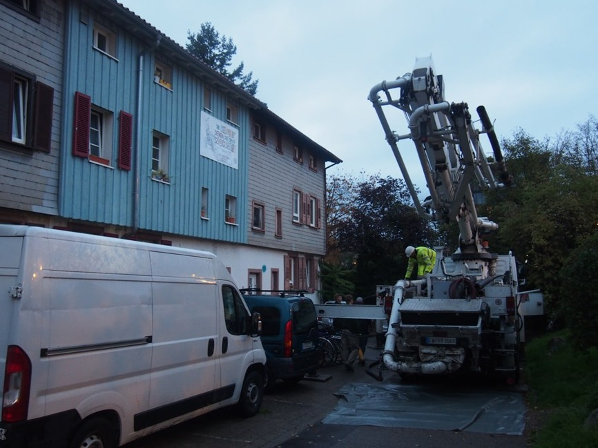
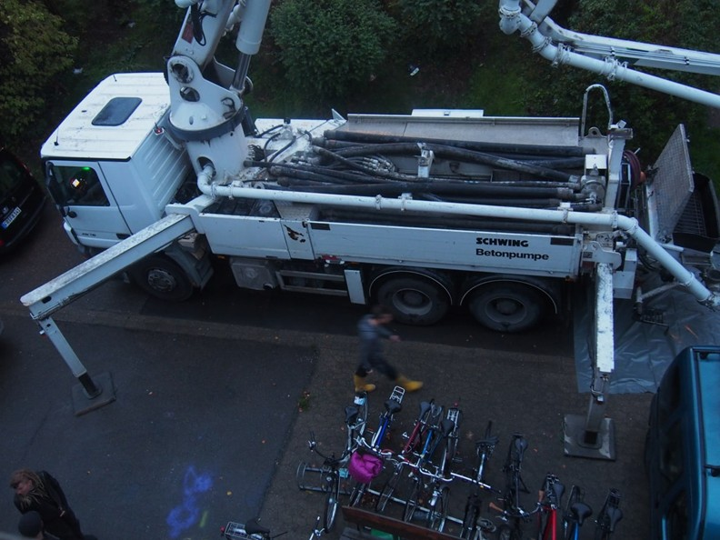
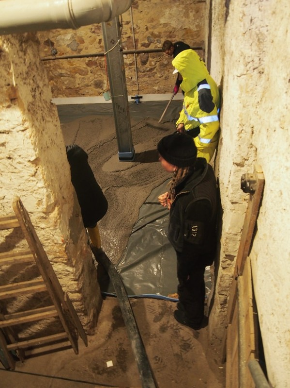
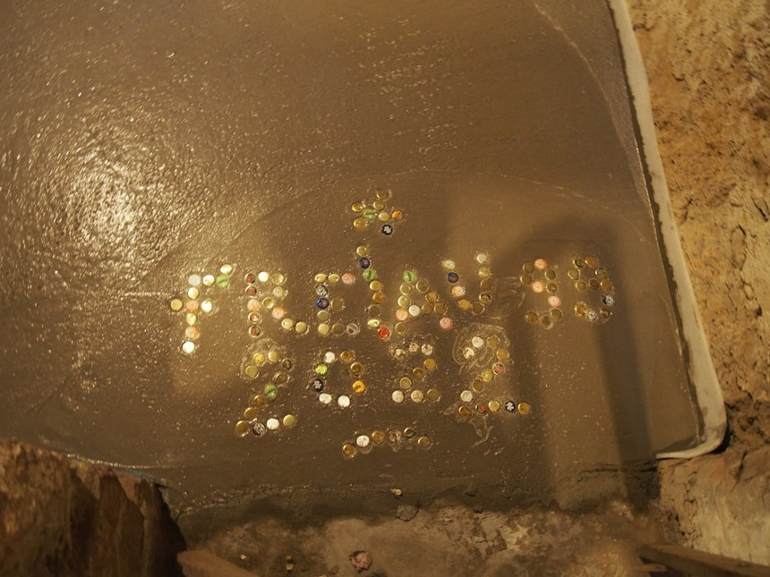

Hallo ihr alle,\
\
Was bisher geschah - Achtung, jetzt wird es ein bisschen verwirrend:\
Frans kommt zurück in sein Zimmer aus dem Erasmus, Elias zieht von Frans neuem Zimmer in Lui’s Zimmer, Lui zieht von Elias neuem Zimmer in Luka’s Zimmer und Luka zieht aus. Lui geht ins Erasmus nach Bologna, zieht im Zuge dessen fest aus und Luka zieht fest in Lui’s Zimmer ein. Ilenga kommt dazu, versucht es mit Luka in einem Zimmer mit dem Konzept des funktionalen Wohnens. Sinja wohnt übergangsweise bei Frans.\
\
So, die Details sind für euch wahrscheinlich ebenso belanglos wie verwirrend. Warum möchte es dennoch mit euch teilen? Trotz nüchterner, zeitgeraffter Schilderung schwingt denke ich das Gefühl der vielen Umbrüche und Neuanfänge mit, welches in den letzten Monaten die Wohnräume der Freiau99 erfüllt haben. Möbel sind während eines 4 Personen Umzuges durch das Treppenhaus rauf und runter geflogen wie Türen auf und zu, wir vermissen unsere Lui und freuen uns über Ilenga. So ist das mit den Abschieden und den Türen, & dort wo sich eines schließt, öffnet sich was Neues, das kennt ihr ja. So blicken wir hoffentlich in einen ruhigeren, niedergelasseneren Winter, wobei das Wetter bis gestern andere Gradzahlen hat spielen lassen.\

Spielen lassen haben wir auch allerlei Kraft bei der gemeinsamen Kellerbetonierung. Mit geballter Muskelkraft, beziehungsweise dem etwas weniger heroischerem Wissen, wie man die entsprechenden Maschinen richtig bedient, war der Keller knappe 5 Stunden später gekleidet in ein neues graues passgenaues Kleid. Zur großen Freude unser und auch einiger Künster:Innen und Bands, welche sich auf ihm bereits erproben konnten. Denn das ist ja auch der Plan, den neu geschaffenen Raum zu öffnen für kleinere Kulturveranstaltungen jedweder Art.

All das wurde ermöglicht, durch einen Bekannten des Hauses und seine elektrischen Freunde. Danke hierfür!

::::::: grid
::: g-col-6

:::

::: g-col-6

:::

::: g-col-6

:::

::: g-col-6

:::
:::::::

\
Die Bodenliebe erreicht auch die Bereiche über der Erde. Frisch ausgesäte Rasensprößlinge wurzeln beträchtlich gut unter den stolzen Blicken von deren Papa Frans. Während die Freiau99 sich kurzzeitig in einen Ort verwandelte, wo Bewohner:Innen sich als Vogelscheuchen verkleideten, der Rasen fast schon mit Hilfe eines Lienales gemessen und nicht betreten werden durfte, gut versteckt hinter Absperrband. Aber alle Müh hat sich gelohnt und der Garten erblüht in neuem grünen Glanz - danke Frans.\
Ansonsten gefüllt mit bodenständigem Alltag, gemeinsamen Mensagängen, Tischtennis in immer früheren Sonnenuntergängen und wärmehaltendem Sockenstricken, schleicht sich natürlich auch bei uns der Winter ein. Pläne darüber, wie die Kälte draußen und die Gemütlichkeit drinnen bleiben kann werden fleißig geschmiedet.\
\
Das wünschen wir auch euch, also Kälte draußen und Gemütlichkeit drinnen!\
Bis bald,\
\
Eure Freiau99!
