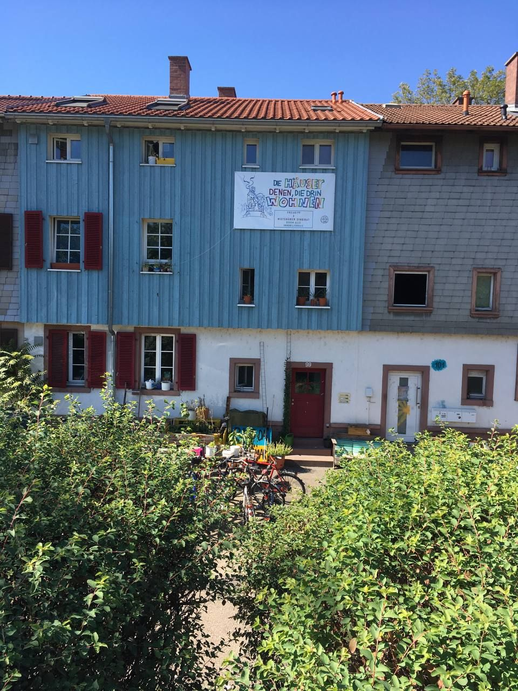

Liebe alle,\
\
So, das Jahr 2022 ist nun offiziell vorbei. Und klar, wir könnten das Jahr auch einfach mal in der Mitte des Jahres rekapitulieren, nach dem Nouruz zum Beispiel, dem Neujahrs- und Frühlingsfestes des persischen Kulturraumes im Mai nach, aber am passendsten ist hierfür doch einfach nach wie vor Silvester. Also heißt es nun, an einem so grau regnerischen Tag, nach sich legender Neujahrsaufregung nun: Beine hochlegen für die kleine aber feine best of Freiau 2022 Rekapitulation.\
\
Da der letzte Newsletter gar nicht so lang her ist und der Zimmerwechsel-Wirbelsturm dort in all seiner charmanten Pracht bereits hinreichend beschrieben wurde, widmet sich dieser kleine Zwischeninput vor allem einem Kulturspecial. Wir wollen zeigen, was wir letztes Jahr selbst alles ermöglichen konnten und worauf wir stolz sind. Durch unsere Kulturveranstaltungen, welche in größeren Abständen im Keller stattfinden, schaffen wir einen Raum für junge Musiker:Innen, ihre Kunst an größeres Publikum zu tragen. Dabei bewegen wir uns in Spektren von lautem Punk über trommelnde Bässe bis hin zu Gesang mit Synthesizern aus Schweden und mehr.\
\
Die daraus entstandenen Einnahmen gingen teils natürlich an die Künstler:Innen selber, aber es konnten vor allem auch Spenden an die ukrainische Organisation (deutsch-ukrainische-Gesellschaft Freiburg), die künstlerische Plattform Delphi-Space/GVBK (welche in Freiburg regionalen und überregionalen Künstler:Innen Raum für die Ausstellung künstlerischer Positionen zu aktuell gesellschaftlichen Positionen ermöglicht) und die solidarische Unterstützung von Freund:Innen in schwierigen Situationen generiert werden.\
\
So, und wie man das nach einem so gelungenen Silvester so macht, hoffen wir, dass die gemilderten Temperaturen zumindest zu einem reibungslosen Rutsch verholfen haben.\
Durch mitternächtliches sich-gegenseitig-in-den-Armen-liegen in der Silvesternacht haben wir durch gemeinsam gestärkte Standfestigkeit jedenfalls ein einwandfreies und kuschliges Rutschen erlebt.\
\
Bis bald wieder & ein gutes neues Jahr,\
wünscht die Freiau99 :-)
