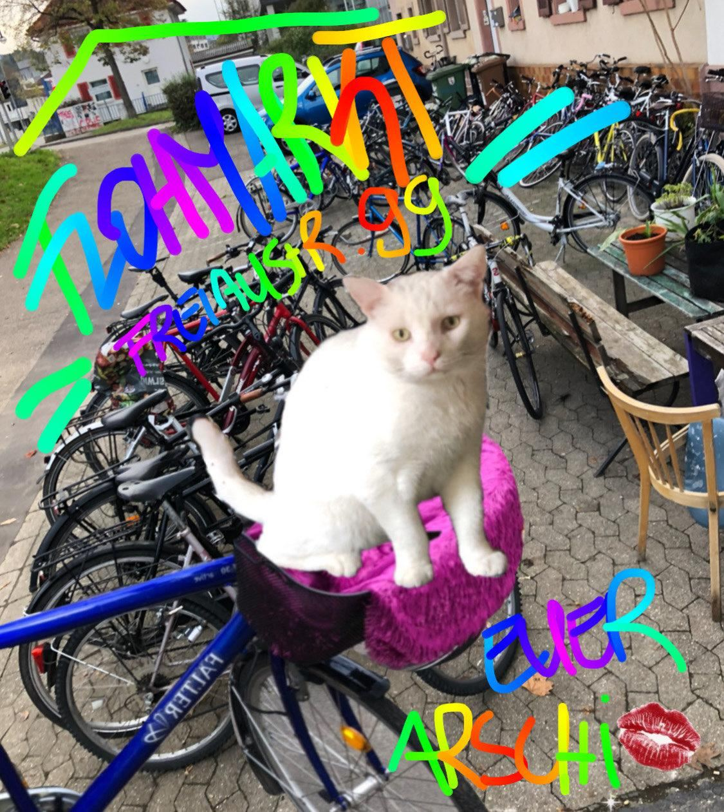
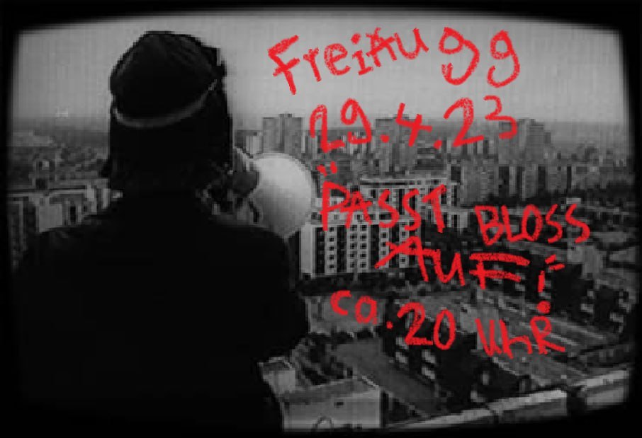

Liebe Lesende,\
\
*Erstmal zu uns & dem, was bisher geschah:*\

Der Kater liegt auf dem Sofa und schnurrt. In Entspannung senkt und hebt sich sein Brustkorb, alle viere von sich gestreckt. Ohne es zu wissen, beschreibt er unsere Situation im Haus damit sehr gut. Es ist tiefer Sommer, die Temperaturen klettern und klettern und versetzen das Treiben hier in ein entspanntes, entschleunigtes Schnurren.

Gut aufeinander eingespielt haben wir uns, jeder mit einem Fuß im Haus und mit einem in seinem Kram. Nur der Can, wo der gerade seine Füße drin stecken hat, weiß niemand so genau. Can hat vor ein paar Monaten seine Sachen gepackt, Marvin seinen Hausschlüssel überreicht und sich für ein Jahr in die Welt verabschiedet, in die Ganze, und wo auch immer er gerade ist, seine Füße stecken bestimmt in was sehr Abenteuerlichem. Und neben Marvin begrüßen wir auch Daniel in unserer wortwörtlichen „Mitte", eingezogen in das ehemalige Zimmer von Chris. Schön, die Beiden hier zu haben.

Was auch ein immer schleichender Prozess ist, ist die Erkenntnis der Aufmerksamkeitsbedürftigkeit eines selbstverwalteten Hauses. Instandhaltung braucht Zeit, Wissen und Aufmerksamkeit. Auch wir müssen hier noch vieles lernen und lernen aber auch stetig dazu, was man unschwer am Prozess unserer Dusche erkennen kann. Wir freuen uns nun mit der Sanierung des Holzfundaments endlich, dass der Neubau der Dusche beginnt.

*So viel dazu :-)*\

Ansonsten ist hier einiges passiert das Frühjahr über.

Kurz ein paar Worte zu einem Dokumentationsabend, welcher in den Frühjahrsmonaten organisiert wurde. Die Geschichten von der Vergangenheit der Freiau haben uns immer mal wieder beschäftigt. Ungefähr waren uns die Besetzungen damals bekannt, und gepaart mit großem Interesse an der generellen Besetzungsgeschichte Freiburgs haben wir uns schließlich dran gemacht, unser Halbwissen zu vervollständigen. Im Rahmen dieser Veranstaltung haben wir den Film „Pass bloss auf!" der von der Medienwerkstatt von 1982 zeigt, der die Lebensrealität der Hausbesetzer_innen in Freiburg von innen heraus spielerisch präsentiert.

Wir haben dazu filmschaffende Personen von der Medienwerkstatt und einige Zeitzeugen der Hausbesetzungen der 80er eingeladen, darunter auch jemand, der in der Besetzung der Freiau dabei war, um sich in einer gemeinsamen Runde danach über die Zeit auszutauschen. Aus dem Archiv für Soziale Bewegungen haben wir Bild-, Video-und Flyermaterial organisiert und eine kleine Ausstellung damit installiert.\
Dem Keller mussten wir da gar nicht so viel abverlangen, gewohnt war er schon daran als Ausstrahlungsort zu dienen, von einer Premiere eines Skatefilms, welcher ein paar Monate zuvor gezeigt wurde. Beide Male hat er enormen Ansturm genossen, war prall voll und hat in seinem betonierten Kleid gestrahlt. Ansonsten ist unsere Zeit gespickt von kleineren Veranstaltungen, wie Flohmärkten und der ein oder anderen musikalischen Situation im Keller.\

\
*Was um das Haus passiert…*\
\
Wir möchten außerdem nochmal kurz auf einen aktuellen kommunalpolitischen Prozess hier eingehen, welchen wir mit einigem Unbehagen beobachten:\
Wie Ihr bestimmt mitbekommen habt, sind in den gesamten Freiburger Parkanlagen (ausgenommen der Eschholzpark und das Sternenwaldeck) laute Musik, ob durch Musikinstrumente oder Bluetooth-Lautsprecher produziert, von 23-6 Uhr verboten.\
Es ist ein kontroverses Thema:\
Natürlich verstehen wir die Notwendigkeit eines gemeinschaftlichen Umgangs in Toleranz, wir verstehen, dass Lärm sehr belastend ist und man in Städten sehr eng nebeneinander koexistieren muss. Dennoch fragen wir uns, ob das fast generelle und pauschale Musikverbot nach 23 Uhr nicht zu kurz und einseitig gedacht ist. Parks gehören zu einer der wenigen kostenfreien und konsumzwangbefreiten Freiräume der Stadt.\
Dabei ist es wichtig sich zu fragen, von wem dieser öffentliche Raum genutzt wird, welche alternativen Möglichkeiten der Verwirklichung für die Menschen existieren und aus welcher Position wir Stellung zu einem solchen Verbot beziehen. Welche Notwendigkeit spielen kostenfreie Räume in unserem eigenen Leben? Bedeutet kollektives und solidarisches Miteinander nicht gerade auch dafür Sorge zu tragen, Räume der Verwirklichung für jede gesellschaftliche Gruppe zu schaffen, gerade wenn „kostenfrei" eine größere Rolle spielt oder diese zumindest in Prozesse der Entscheidungsfindung miteinzubeziehen? Denn öffentlicher Raum hat eine lange Historie, in dem er sowohl als Ressource der Selbstbehauptung und Sichtbarwerdung aber auch als Instrument für Verdrängung für städtische Akteure dienen kann.\
\
Nutzungskonflikte werden immer wieder zu Ungunsten der Meinungen und Bedürfnisse junger oder marginalisierter Menschen entschieden. Es verweist auf das große Problem der gesellschaftlich diversen Repräsentanz bei der Entscheidungsfindung kommunalpolitischer Problemstellen. Die Mehrheit im Gemeinderat stimmte dafür, wer jedoch fast nicht dabei vertreten war, waren die wirklichen Parknutzer:Innen (nach 23 Uhr). Es geht bei der Fähigkeit, sich im öffentlichen Raum Gehör zu verschaffen, auf tieferer Ebene vor allem auch um Entscheidungen darüber, wer Teil der städtischen Gemeinschaft ist und die Mündigkeit besitzt, diese mitzugestalten.\
Die Fragen, die bleiben: Welche kostenfreien und konsumzwangsbefreiten Orte können in Freiburg noch aufgesucht werden? Und ist Repression wirklich der beste Weg oder bieten alternative Handlungsmethoden wie Mediation nicht de-eskalierenderes Potential?\
Wir wissen, dass dem zugrunde ein komplexer Konflikt liegt, den wir hier nur kurz angeschnitten haben und wollen betonen, dass wir das Bedürfnis nach Ruhe verstehen, dennoch diese Impulse kurz anstoßen.\
\
Einen schönen Sommer Euch allen und bis bald!\
Eure Freiau 99
