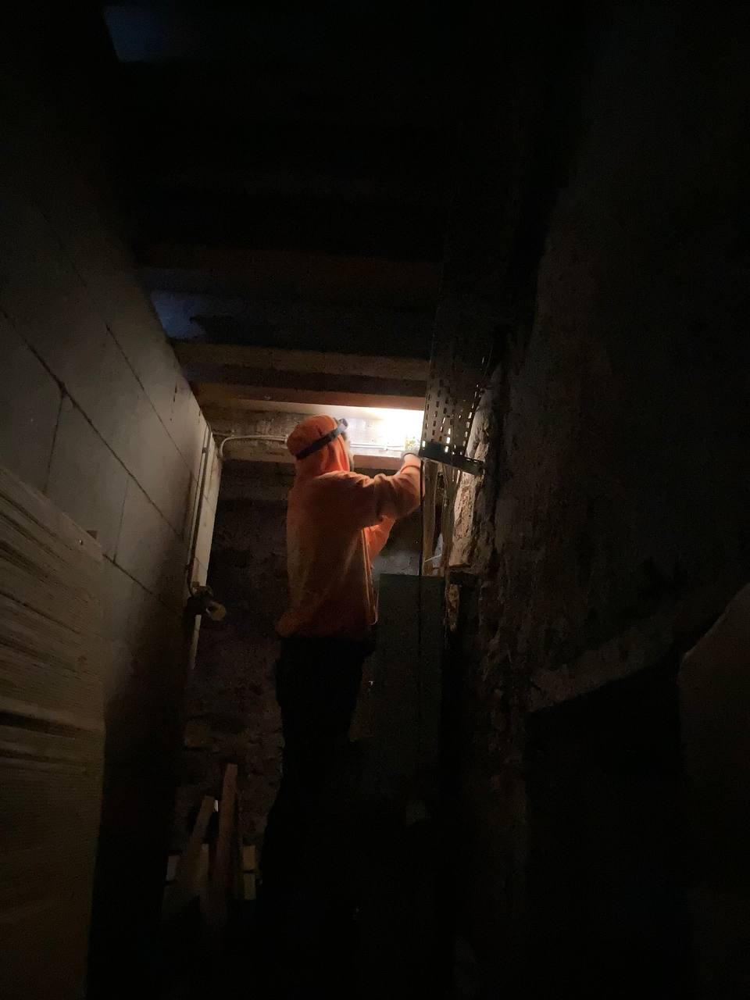
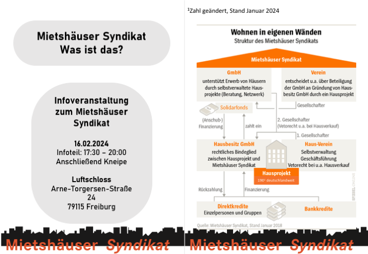
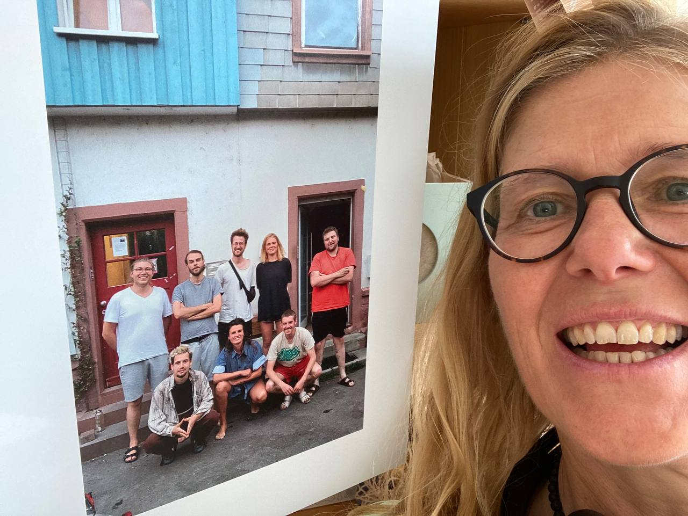

Liebe Lesende,

Es ist ein neues Jahr. Dieses ist mittlerweile zwar schon etwas länger, jedoch blieb ein angemessener Umgang mit der Jahreswende bisher aus. Jedoch eignet sich auch für uns, wie für die ganzen Podcasts, Zeitschriften und sonstigen Kanäle, dieser Anlass fantastisch als reflexives Instrumentarium für eine nostalgisch ausschweifende Rekapitulation. Hier ein kleines transparentes Update und Rückblick aus dem Alltagsgeschehen der Freiau99 im noch fast frischen, jetzt schon viel zu bewegenden Jahr 2024. Lehnt Euch zurück, legt die Füße hoch und rutscht Euch in gemütliche Pose zurecht.\
Das Leben hier im Haus manchmal emsig, gleich einem Bienenstock, jede:R die Füße in der eignen Alltagssuppe, aber dennoch verbunden durch gemeinsame Ziele und Projekte im Haus. Mal in kleineren Gruppen mal als Ganzes. In dynamischer Weise werden so im Haus vielerlei kurz- oder längerfristige Projekte realisiert, ploppen hier und mal da auf, dass man selbst den Überblick über das große Ganze verlieren kann und überrascht hineinschlittert. Im Folgenden werden nun mal ein paar umrissen:

*Weihnachtsessen*\
Bei den fröhlich steigenden Temperaturen draußen kaum noch vorstellbar, allerdings hat es auch in unseren Küchen mal nach Rotkohl mit Nelken, Knödel und Pilzrahmsauce geduftet. In Töpfen von gigantischem Ausmaß schmorten Leckereien vor sich hin, als hätten sie sich zum Vorbild das Märchen des süßen Breis der Gebrüder Grimm genommen. In einer großen Runde zelebrierten wir gemeinsam zwar wohl eher, dass wir gemeinsam waren, als die Geburt Jesu, nahmen die Weihnachtszeit jedoch trotzdem dafür zum Anlass.

*Elektrifizierung des Kellers*\
Dieses Projekt hat gleich zwei Vorzüge der Systematik des Mietshäussyndikats aufgedeckt: 1.: Wer selbstverwaltet, kann viel lernen. Das checken wir immer wieder. Und 2.: Ein breites Netzwerk kann sich gegenseitig stützen und nähren. Besonders deutlich hat sich das im Jahr 2023 an dem Einsteiger:Innen Workshop in Sachen Elektronik und Steckdosenkunde gezeigt. Gemeinsam mit Fachkundigen eines befreunden Hausprojekts haben wir eigenständig unseren Keller nicht nur mit packenden tanzkulturellen Veranstaltungen elektrisiert, sondern auch durch die Verlegung neuer Steckdosen und Lampen.

*Ein neues Patenprojekt – Die Fruchtschranne* Apropos Vernetzung, wir dürfen mit Freude verkünden, dass wir nun über ein Patenprojekt, die „Fruchtschranne" in Tübingen verfügen, mit welchem wir nun einander untergehakt in eine eng verbundene Zukunft spazieren können.

*Kneipenabende und der Solitopf*\
Neulich mal wieder einen Blick in unsere Vereinssatzung geworfen. Über mehrere Paragrafen wird hier Aufbau, Organisation und Zweck unseres Hausvereins Freiau99 e.V. genauer definiert. In §2 Vereinszweck heißt es hier:

„**Zweck des Vereins ist die Förderung von Initiativen zur Verbesserung der Wohn- und Lebensbedingungen in Freiburg sowie der politischen Bildung, Kultur, Kommunikation und des nachbarschaftlichen Miteinanders.**"

Ganz im diesem Sinne haben wir begonnen, unseren Keller für gemeinsames und nachbarschaftliches Zusammenkommen einmal monatlich im Rahmen von geselligen Kneipenabenden zu öffnen. Diese können thematisch variieren, mit unterschiedlichen Kontexten gefärbt werden, wobei Spenden dabei an Projekte wie beispielsweise den SOLITOPF weitergeleitet werden. Falls ihr Lust habt, bei einem dieser vorbeizuschauen oder mehr über den SOLITOPF wissen wollt, schreibt uns einfach gerne :-)

*Kurz zum Solitopf:* *Der SOLITOPF ist ein Umverteilungsprojekt in Freiburg. Menschen die einfacher an Geld kommen, geben etwas davon an Menschen weiter, für die das sehr viel schwieriger ist, weil sie keine Möglichkeit haben, für Lohn zu arbeiten. Er ist aus dem Rasthauskontext entstanden und unterstützt Menschen mit Fluchterfahrung.* *Er lebt von einmaligen oder monatlichen Einzahlungen von Einzelpersonen, die zu 100% an die betroffenen Personen ausgeschüttet werden. Das Geld wird zum Beispiel für die Beteiligung an Mietkosten oder Verfahrens- und Gerichtskosten verwendet. Diese und andere Alltagskosten entstehen oftmals durch Kriminalisierung und Illegalisierung von Einwanderung. (Mehr zum Solitopf: <https://rdl.de/beitrag/solitopf>)*

*Skatevideoabende*\
Für die Skateboardszene wurde auch der Keller zur Verfügung gestellt. An zwei Abenden kam es hier zu einem Mehrgenerationen-Treff bei dem einige der alten Hasen der Freiburger Skateszene historische Quellen präsentieren konnten. Das “warten bis Gott kommt” Video aus dem Jahre 2001, das „Deadline" aus dem Jahre 2003 sowie das “FlickFlock” Video mit Akteuren aus Freiburg und Umgebung, gab der jüngeren Skategeneration einen Einblick in die Geschehnisse der damaligen Zeit. Im Anschluss gab es bei dem ein oder anderen Bier die Möglichkeit für „Oldies" und „Yung-Guns" sich über die damalige und heutige Zeit auszutauschen.\

*Binnenverträge*\
Bereits ein wenig gespoilert, haben wir uns auch erneut mit der hausinternen Projektausrichtung befasst. Langfristig ausgerichtetes Zusammenleben will gepflegt werden, wie Rasenpapa Frans unseren Garten. Gerade in einem Projekt, welches sich nicht auf rein materielles Wohnen beschränkt, sondern den Raum als Ressource für das Wachsen gesellschaftlicher Projekte und Initiativen begreift, gilt es, das Verständnis der Hausmitglieder über die Vorstellung, Ausrichtung und das Wesen des Projektes immer mal wieder transparent zu machen, genauer zu definieren, aufeinander abzustimmen und zu überarbeiten. Wer sich über das Selbstverständnisses des Verbundes im Klaren ist, kann erst die vereinte Power und damit einhergehenden Kapazitäten voll ausschöpfen. Wir haben deswegen einen länger angedachten Prozess über die Ausarbeitung von projektzentrierten Binnenverträgen begonnen, um uns mit Fragen zu beschäftigen wie: welche Vorstellungen/Erwartungen haben wir von unserem Projekt, was brauchen wir persönlich von diesem und wo sehen wir seine gesellschaftliche Rolle?\

*Infoveranstaltung*

Wie es sich auch nicht anders gehört, und vielleicht an der ein oder anderen Stelle dieses Newsletters vielleicht durchgeklungen ist, sind wir überzeugte Fans des Konzeptes des Mietshäuser-Syndikats. Deswegen haben wir es uns in kürzester Vergangenheit herausgenommen, Werbung in eigener Sache im Rahmen einer öffentlichen Informationsveranstaltung zu machen. „Mietshäusersyndikat – was ist das überhaupt?" wurde dabei zentral aufgerollt und anhand von konkreten Projektvorstellungen nähergebracht.

*Direktkredite*\
Nun zu einer etwas seriösen Geschichte und nochmals Werbung in sehr eigener Sache: Auch die Freiau99 sucht dauerhaft nach neuen Direktkrediten, um alte Direktkredite problemlos wieder abbezahlen zu können. Aktuell ist bei uns finanziell noch alles in bester Lage und um dies weiterhin so beizubehalten, benötigen wir neue Direktkredite. Leitet diese Info gerne an mögliche Interessenten weiter, diese können sich dann an “[info-freiau99\@riseup.net](mailto:info-freiau99@riseup.net)” wenden, um dann von unseren Liebsten, Magda und Daniel, beraten und informiert zu werden.

*Und sonst so?*\
Außerdem haben wir uns überlegt, den Newsletter als Möglichkeit zu nutzen, immer mal wieder kleine Einblicke in das Leben einzelner Hausmitglieder zu geben.

November letzten Jahres hat Magdalena ein spannendes Projekt in der UB Freiburg ausgestellt: „Klassismus sichtbar machen. Eine soziologische Fotoreihe der feinen Unterschiede“. Um jede\*n zum reflektieren über „die feinen Unterschiede” verschiedener sozialer Herkunften anzuregen, hat sie eine Fotoreihe ausgestellt, diese hatte Folgendes als zentralen Inhalt:\
„Sozialschmarotzer, Assi-TV, in der sozialen Hängematte chillen, die wollen ja eh nicht arbeiten – Diskriminierungen aufgrund der sozialen Herkunft oder sozialen Position erfahren täglich Millionen von Menschen in Bereichen der Bildung, des Wohnens, der Arbeit, der Gesundheit und im gesellschaftlichen Miteinander. Und trotzdem ist das Wissen über Klassismus noch peripher. Um dies zu ändern, hat die Soziologiestudentin Magdalena Bausch Häuser, Wohnzimmer und die Bewohnenden fotografiert."

Wer diese spannende Ausstellung nochmal besichtigen möchte hat die Möglichkeit dazu hier: Basel bis 14. Mai im Petersgraben 27. <https://soziologie.philhist.unibas.ch/de/aktuelles/veranstaltungen/details/klassismus-sichtbar-machen/>. Oder in der Besprechung bei Soziopolis zu lesen: <https://www.soziopolis.de/die-unterschiede-in-den-couchecken.html>; Basel.\
\
Liebe Grüße,\
Die Freiau99 :-)
