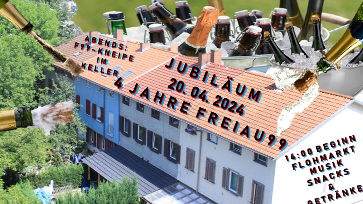

Liebe Lesende,

Wir schreiben den Monat September. Das Wetter verwirrt unsere Gemüter mit Unbeständigkeit ohnegleichen, lässt erstmals erinnern, was dieser sog. Herbst nochmal war. Die Sonne allgemein etwas goldener, die Regentage allgemein einen Tick düsterer. Erstmals wieder eingekuschelte, eng zusammengeraffte Ansammlungen in den Küchen dieser Stockwerke.\
Im Dampf des Tees reiten unsere Gedanken zurück in die letzten Monate:

*Handwerkungen*

Unser Haus hat kleinere und größere Schliffe und Upgrades erhalten.\
Auch wir sind in den letzten Monaten die Modernisierungsleiter der Haushaltsgeräte eine Sprosse weiter emporgeklettert. Wo lange Zeit das akribische Tellerwaschen zum routinierten Alltagsleben der Küche im EG gehörte, kann sich diese nun auch zu den stolzen Besitzenden einer vollautomatischen Spülmaschine zählen.\
Was nun endlich auch wieder in neuem Glanz strahlen darf, allerdings noch durch eigene Handarbeit betrieben, sind die Menschen des Erdgeschosses selbst. Nachdem unsere Dusche eines unbedeutenden Tages etwas überambitioniert die Couch im Keller mitduschen wollte, standen wir doch einer größeren Herausforderung entgegen. Was anfangs in Eigeninitiative begonnen wurde, fand nun vor einiger Zeit seine professionelle Fertigstellung durch handwerkende Hände und glänzt nun wieder Badreiniger-Werbungs-gleich.

{alt="Flyer"}

*Kulturelle Events*\
Alles wie gehabt es sich bei der routinierten Organisation kultureller Veranstaltungen und Zusammenkünfte. Besuch erhielten wir beispielsweise von befreundeten Menschen aus Duisburg die mit Rap und Hiphopbeats den betonierten Boden des Kellers vibrierten ließen. Außerdem zelebrierten wir das 4 jährige Freiaujubiläum ausgiebig mit Flohmarkt, Küfa (Küche für Alle) und anschließendem Barvergnügen.

Aber nicht nur Beats sollen unseren Keller füllen. Wir haben ein Scheiß-Erlebnis einer befreundeten Person zum Anlass genommen, in einer Austauschrunde über sexuelle Übergriffigkeit in den “eignen Reihen” - der linken Szene - zu sprechen. Nach gemeinsamem Grillen und einander vertraut machen haben wir den Raum geöffnet, eigene Erfahrungen, Emotionen, Gefühle, Gedanken und mögliche Umgangsformen miteinander zu teilen. Die Runde war groß und umso schöner war es, dass Barrieren aus Scharm und Schüchternheit angetastet werden und reger Austausch zustande kommen konnte über ein Thema, welches durch Stillschweigen nicht seine Präsenz verliert.

*Eigenes Obst & Gemüse*\
Äpfel unseres Baumes fielen dieses Jahr wie Sterne vom Himmel. Das Betreten des Gartens ohne Helm verlief auf eigene Gefahr. Apfelmus und Applecrumble konnte fließen wie Milch und Honig. Und auch ansonsten wurde dieses Jahr am gärtnerischen Geschick getüftelt wie lange nicht mehr. Die Tomaten wucherten über sich selbst hinaus, warfen rote Früchte ab, als gäb’s kein Morgen mehr. Zucchini, Bohnen und Kapuzinerkresse, Rhabarber und Paprika freuten sich der Symphonie des Wachsen-und-Gedeihens.

*Ansonsten:*\
Noch zu erwähnen: Elias und Luka schwärmen für ein halbes Jahr aus. Sie nutzen beide die Möglichkeit des Erasmus, Elias in Ljubljana und Luka in Istanbul. Bewohnt werden die Zimmer in der Zeit von Tobi und Macel. Herzlich willkommen! So, genug der Rekapitulationen. Tee kalt, dampf weg und das wars erstmal mit dem kleinen Update von uns.\
Bei Fragen oder Anregungen meldet euch gern!

Liebe Grüße und eine schöne Herbstzeit euch!\
Eure Freiau99 :-)
