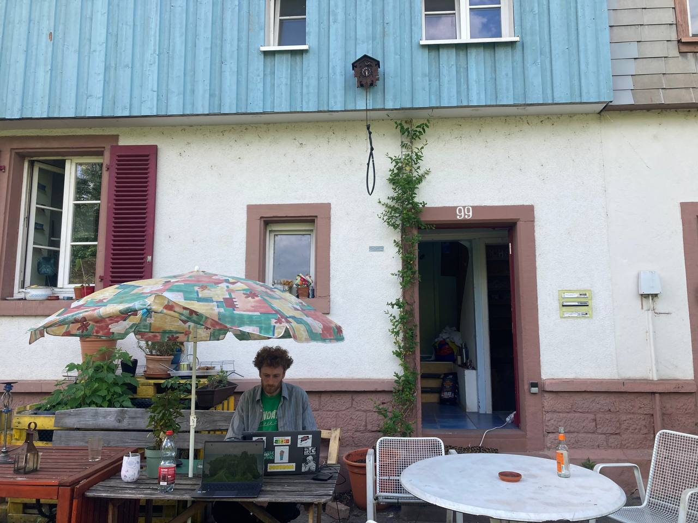
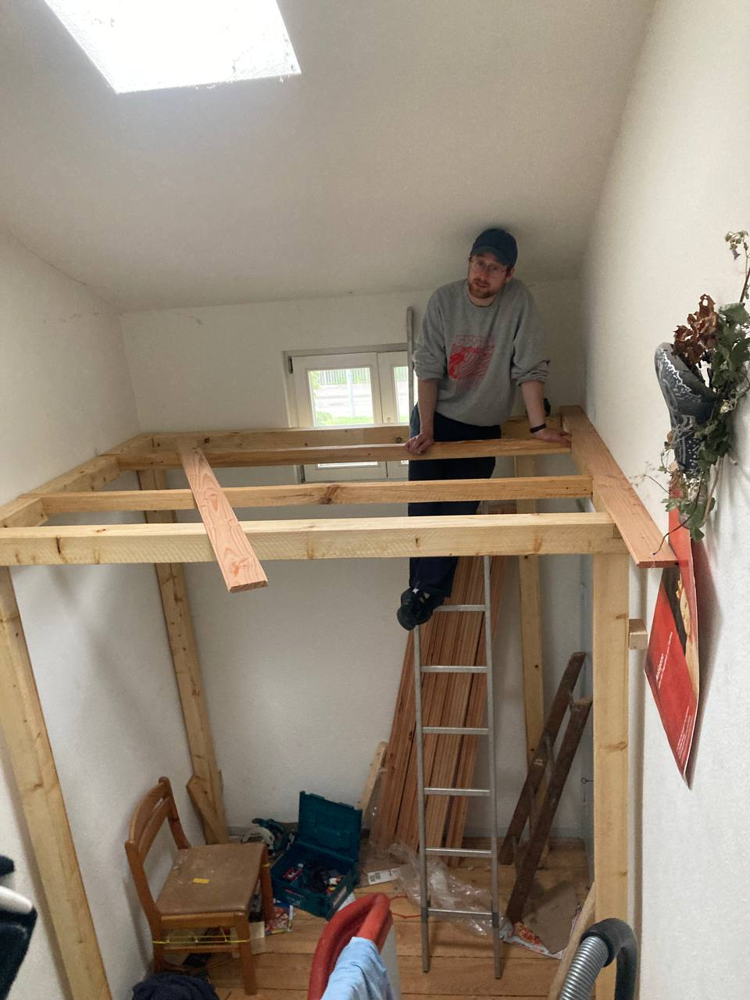

Hallo liebe Unterstützer:innen,\
hier mal wieder ein Update von uns. Vieles hat sich verändert und einiges ist noch wie immer.

Angesichts der stetig rechter werdenden Politik sind wir froh, mit unseren Veranstaltungen Menschen in unserem Umfeld unterstützen, und so einen Beitrag zur Diversität der Gesellschaft beitragen zu können.

Im September haben wir anläßlich eines Falls sexualisierter Gewalt eine Solidaritätsveranstaltung organisiert und damit das Geld für die Gerichtskosten der betroffenen Person gedeckt. Das Publikum durfte sich über feinsten live HipHop gemischt mit tanzbarer Bass-Musik freuen. Im November haben wir eine weitere Person mit einer Solidaritäts-Veranstaltung finanziell helfen können, und sie darin unterstützt sich ihrer künstlerischen Arbeit weiter widmen zu können. An diesem Abend wurde Funk und Soul mit Vinyl aufgelegt und die Hüften wurden fleißig geschwungen.

Nun kommen wir zu Hausinternen Neuigkeiten. Unsere Luka ist im September zu einem Erasmus nach Istanbul aufgebrochen und zur Zwischenmiete wohnte jetzt Tobi in ihrem Zimmer. Auch Elias ist zum studieren für ein halbes Jahr nach Ljubljana gegangen und für ihn wohnte Marci bei uns. Beide sind wohlauf und wieder im trauten Heime. Wie schnell doch die Zeit vergeht. Marci wird auch weiterhin bei uns wohnhaft bleiben, da Alina leider die Stadt verlässt, und dadurch ein Zimmer dauerhaft frei wird.

{alt="Marci im Homeoffice"}

Ende 2024 hatten wir außerdem in einem Plenum das Thema Mietpreise, um zu überprüfen ob die Miete, die wir aktuell zahlen noch mit den Kosten und Ausgaben des Hauses übereinstimmt. Wir haben daraufhin die Nebenkosten in den Verträgen senken können und den Solidarausgleich für die großen Zimmer abgeschafft. Vorher haben die kleineren Zimmer etwas mehr gezahlt als sie müssten, damit die großen Zimmer nicht so teuer sind. Da nun aber die Nebenkosten gesunken sind und alle sich einig waren, haben wir diese Regelung abgeschafft.

Es gibt auch ein paar Instandhaltungsprojekte: Zum einen wurde im 1. OG ein zusätzliches WC in den Flur gebaut, damit Gäste auf unseren Veranstaltungen nicht zwingend in unsere Wohnungen gehen müssen. Außerdem ist im Flur im 2. OG ein Gästebett für Freund:innen auf der Durchreise entstanden. Unser zugezogener Schreiner Marci hat sich mit der vereinten Frans-Power diesem Projekt gewidmet und es ist ganz wunderbar geworden! Die Durchreisenden, Betten- und Hausbesucher sagen Danke!

{alt="Frans Zillig"}

Anfang Februar 2025 fand zudem in Freiburg eine Mitgliederversammlung des Mietshäuser Syndikats statt (Solidarischer Verbund von bundesweit mittlerweile über 200 Hausprojekten, dem auch die Freiau99 angehört). Vor 35 Jahren würde das Bündnis, „Häuser in Selbstorganisation“ in Freiburg gegründet und auch die diesjährige Freiburger MV hatte eine historisch anmutende Dimension. Bei der vorangegangenen Mitgliederversammlung in Bremen wurde das Klausurjahr beschlossen.\
Klausurjahr deshalb, weil in den Mitgliederversammlungen des Mietshäuser Syndikats - die stets ein wichtiges Entscheidungsinstrument, aber auch eine schöne Möglichkeit zum in-Kontakt-kommen mit anderen Projekten und deren tollen Einwohnis bietet - schwerwiegende Arbeitsfelder bearbeitet werden sollen, während das Wachstum der Struktur in diesem Zeitraum eine nebensächliche Rolle einnimmt. So werden neue Projekte nur in “kleinen MVs” in die Struktur aufgenommen, die sich ausschließlich damit beschäftigen. Wir von der Freiau99 waren bei der Mitgliederversammlung dabei und halten diese Entscheidung für sinnvoll.

Der Frühling nach wie vor im Ankommensprozess und wir freuen uns darauf sehr viel Zeit im Garten verbringen zu können, und dem Apfelbaum beim Blühen zuzusehen. Ihr könnt uns nun auch wieder regelmäßig zu einem kleinen Plausch mit unserem Stand auf dem Markt in Vauban antreffen. Dort wollen wir auch wieder anderen Menschen von unserem Projekt berichten und so neue Direktkreditgeber:innen zu finden.

Vielen Dank, dass du bis hierhin gelesen hast. Wir danken auch weiterhin für die Unterstützung und das Interesse an unserem Projekt. Wir werden dich weiterhin informieren und wünschen bis zum nächsten Newsletter alles Gute und einen schönen Start in den Frühling/Sommer!

Liebe Grüße\
Die FREIAU99
