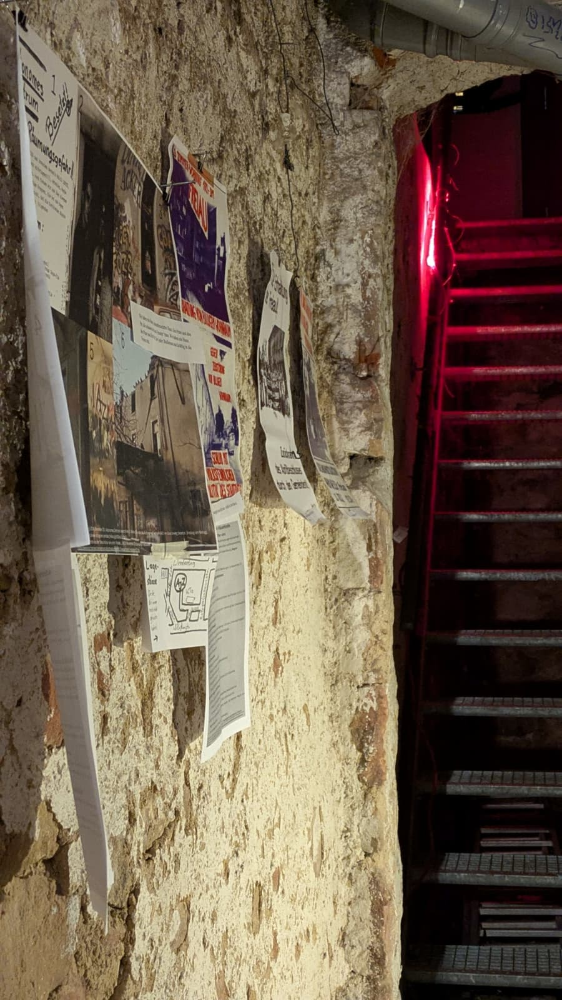
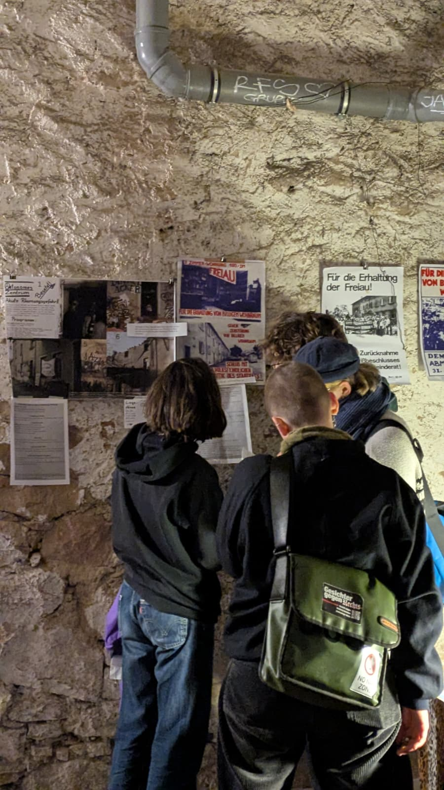
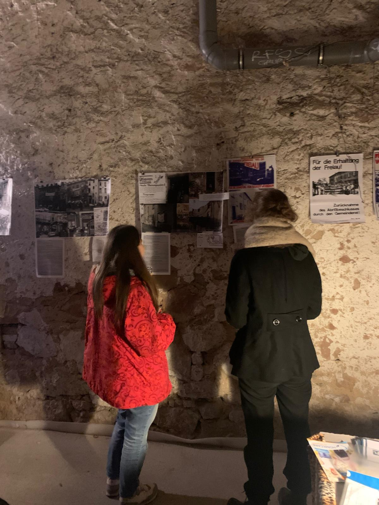
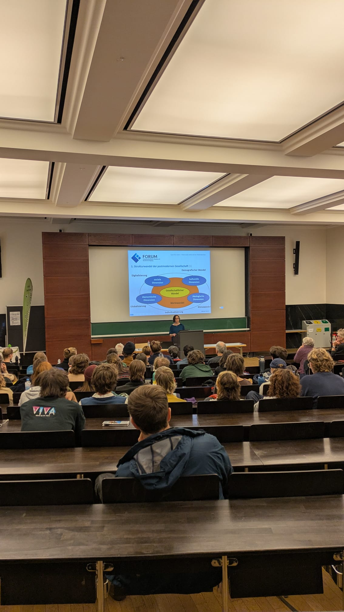

Advent, Advent, die Zeit die rennt, ganz ungehemmt, schon wieder Jahresend. Advent, Advent, das Fundament, der F99, seid ihr justament. Advent, Advent, wärt ihr nicht da, der Freiaus Testament, wären wir ganz nah. Advent, Advent, drum lassets krachen, ganz dekadent, keine halben Sachen. Exzellent und vehement, sagen wir ganz transparent, Danke für euer großes Talent, und auch das finanzielle Element Unsere Liebe, warm sie brennt!

Hallo liebe Leute,

wie oben schon am Rande erwähnt, wurden wir mal wieder vom Jahresende mehr oder minder überrumpelt. Wie jedes Jahr auf‘s Neue bemerkt, ging auch dieses Mal wieder echt sehr schnell. Naja, nun sitzen wir hier zwischen Gulasch und Glühwein und gedenken unserer tollen Direktkreditgeber\*innen. Ebenfalls, wie in der kurzen Lobeshymne oben erwähnt, würde das alles hier nicht so laufen, bzw. gar nicht laufen, ohne Euch! Drum geht der kurzen Rekapitulation des Jahres 2025 ein dickes Danke an Euch festlich, mit Fanfahren begleitet, voran. Toll, dass es euch gibt!

Auch dieses Jahr konnten wir dadurch das ein oder andere kleinere oder größere Projekt verwirklichen und diese in unserer kleinen Gemeinschaft hier genießen. Über vieles wurdet ihr zwischendurch wie immer geupdatet, also hier die Happenings der letzten Monate. Die vorangegangene Dankesrede ausgelebt, haben wir dieses Jahr mit einer kleinen Einladung zu einem gemeinsamen Essen für unsere lieben Direktkreditgebende. Schön wars!

Ansonsten hat unser lieber Daniel eine Veranstaltung über das Mietshäuser Syndikat und alternative Wohnformen organisiert. Eingeladen wurde dazu Romy Reimer, statt fand es in der Uni Freiburg. Life und in Farbe konnte man danach auch selbst ein Projekt erkunden bei gemeinsamem Reflektieren und Ausklingenlassen mit einem Getränk in der Freiau99 im Gemeinschaftskeller.

::::::: grid
::: g-col-6

:::

::: g-col-6

:::

::: g-col-6

:::

::: g-col-6

:::
:::::::

Auch groß in den Keller eingeladen haben wir an Halloween, um zusammen die Premiere eines selbstgedrehten und geschnittenen Skatevideos von Elias zu bewundern. Wie viele Menschen und Skateboards passen in einen Keller? Thematisch vorbereitet und eingeleitet wurde das Ganze von Marius, der, ganz im Sinne des aktuellen lyrischen Freiau99-Trends, ein paar gereimte Zeilen dem Abend, der Freiau99 und ihrer Suche nach Direktkrediten widmete. Die Freiau99 versteht die Schaffung von Räumen für alternative Kultur- und Bildungsprojekte ja als Teil ihres Selbstverständnisses. So wird auch der nächste Punkt sich um den Keller drehen. Die Räumlichkeiten wurden auch von dem Tinku-Kollektiv für eine Musikveranstaltung genutzt, um einerseits mit kleinen Informationsaushängen ein bisschen über das Projekt aufzuklären und andererseits Spenden für das Projekt zu sammeln. Eingeleitet wurde der Abend mit einem gemeinsamen Einstimmen bei leckerer afghanischer Küfa. Das Tinku-Kollektiv ist ein interkulturelles Kollektiv mit Sitz in Deutschland und Ecuador, das sich darauf konzentriert, kulturelle Veranstaltungen mit sozialen und ökologischen Interessen zu verbinden (<https://www.tinku-kollektiv.com/).>

Davon abgesehen ist zu erwähnen, wie wir erfolgreich einen Wasserschaden in dem 1. Und 2. OG bewältigten, bei welchem es plötzlich von Raouls Decke tropfte. Dank unserer tollen Hausmeister konnte Raoul aber fix wieder im trockenen Schlafen!

Außerdem auch noch sehr wichtig natürlich: es gibt jetzt auch Freiau99-Shirts. Das Logo designt an einem Abend in unserer Küche gedruckt auf hochwertige, nachhaltige Baumwollshirts. Auf Spendenbasis mit einer Spendenempfehlung von 20 Euro könnt auch ihr euch damit schmücken! \<3 Mehr Infos hier: <https://freiau99.github.io/freiau99/Merchandise.html>

Ansonsten wünschen wir Euch in dem Sinne auch viele leckere Braten und dampfende Glühweine.

Kommt immer gerne auf uns zu bei Gedanken oder ähnlichem! Wir schicken Euch ganz liebe Grüße, Eure Freiau99
