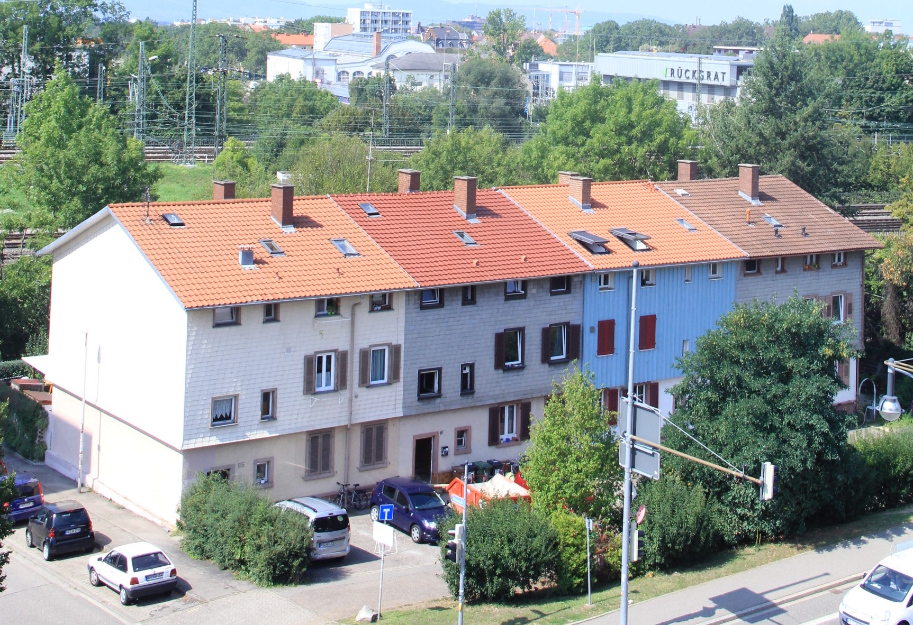
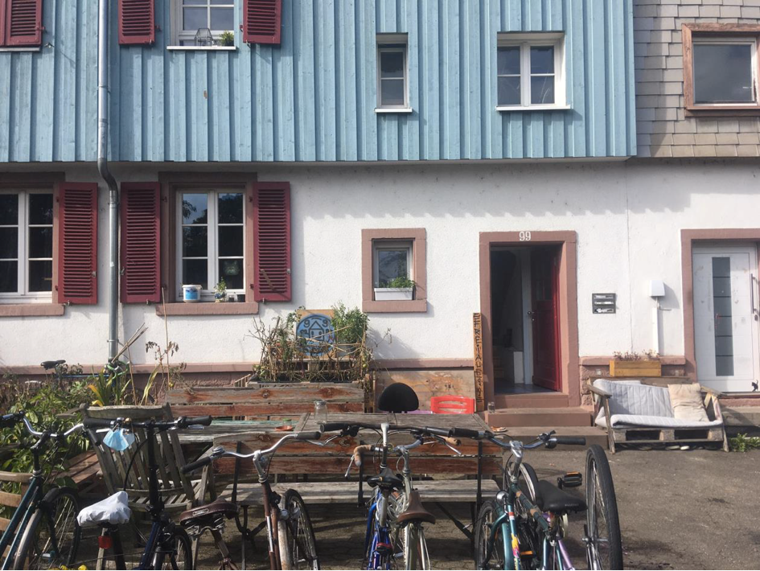

# Wohnraum dem Markt entziehen.

Seit 2020 organisieren wir die Freiau99 in Freiburg selbstverwaltet und dauerhaft außerhalb des Immobilienmarktes.\
Wir sichern bezahlbaren Wohnraum – heute und für kommende Generationen.

::: hero-buttons
<a class="btn btn-outline-primary btn-lg" href="Direktkredite/index.html"> Direktkredite verstehen </a>
:::

------------------------------------------------------------------------

## Warum Freiau99?

Wohnraum in Städten wird zunehmend zu einem Spekulationsobjekt.

- Mieten steigen kontinuierlich\
- Häuser werden verkauft und umgewandelt\
- soziale Strukturen gehen verloren

#### **Wir zeigen eine Alternative:**

Wohnraum kann dauerhaft solidarisch organisiert werden:

Im Frühjahr 2019 erfuhren wir, dass unser Haus verkauft werden soll. Damit standen wir vor einer Entwicklung, die viele Städte betrifft: steigende Mieten und der Verlust bezahlbaren Wohnraums durch den Immobilienmarkt.

Mit dem Hausprojekt Freiau99 setzen wir uns dafür ein, Wohnraum in Freiburg langfristig solidarisch zu organisieren und zu erhalten – für eine offene, vielfältige und bezahlbare Stadt.

::::::: {#carouselround .carousel .slide data-bs-ride="carousel" data-bs-interval="6000"}
:::::: carousel-inner
::: {.carousel-item .active}

:::

::: carousel-item

:::

::: carousel-item

:::
::::::

<!-- CONTROLS (WICHTIG: KEINE WRAPPER!) -->

<button class="carousel-control-prev" type="button" data-bs-target="#carouselround" data-bs-slide="prev">

</button>

<button class="carousel-control-next" type="button" data-bs-target="#carouselround" data-bs-slide="next">

</button>
:::::::

------------------------------------------------------------------------

## Wie wir arbeiten

Die Freiau99 ist ein selbstverwaltetes Hausprojekt.

- gemeinschaftliches Wohnen
- langfristige Sicherung des Hauses
- Finanzierung über solidarische Direktkredite
- keine Gewinnlogik

::: card
<h3>🤝 Projekt kennenlernen</h3>

Du möchtest mehr über unser Projekt erfahren?

<a class="btn btn-outline-primary" href="Über uns/index.html"> Über uns </a>
:::

------------------------------------------------------------------------

## Unterstütze die Freiau99

Die Freiau99 lebt davon, dass Menschen Wohnraum nicht dem Markt überlassen.\
Ohne solidarische Finanzierung wäre dieses Hausprojekt nicht möglich.

::::: card-grid
::: card
<h3>💰 Direktkredit geben</h3>

Hilf dabei, Wohnraum langfristig dem Immobilienmarkt zu entziehen.

<a class="btn btn-outline-primary" href="Direktkredite/index.html"> Mehr erfahren </a>
:::

::: card
<h3>📣 Weitererzählen</h3>

Hilf mit, die Idee solidarischer Wohnprojekte sichtbar zu machen und Folge uns auf Instagram.

<a class="btn btn-outline-primary" href="https://www.instagram.com/freiau99/"> <i class="bi bi-instagram"></i></a>
:::
:::::

------------------------------------------------------------------------

## Freiau99 in Kürze

- 🏠 1 selbstverwaltetes Hausprojekt\
- 👥 9 Bewohner:innen\
- 📍 Freiburg im Breisgau\
- 🌱 seit 2020 solidarisch organisiert\
- 🔒 dauerhaft dem Immobilienmarkt entzogen

------------------------------------------------------------------------

## Kontakt

E-Mail:\
<a href="mailto:info-freiau99@riseup.net?subject=Anfrage">info-freiau99\@riseup.net</a>

------------------------------------------------------------------------

Freiaustraße 99\
79100 Freiburg im Breisgau
