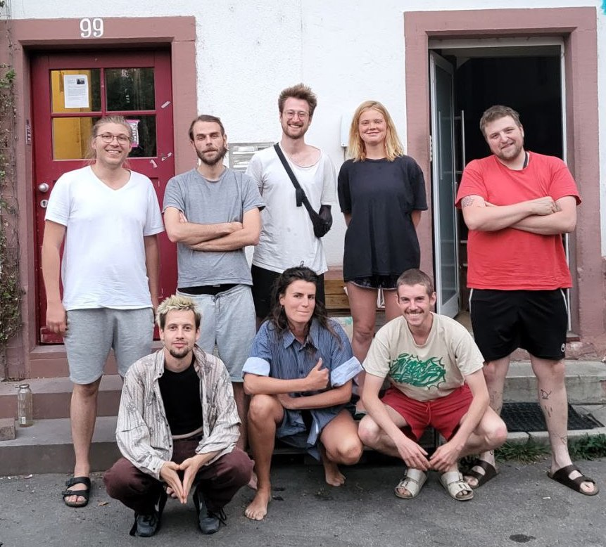
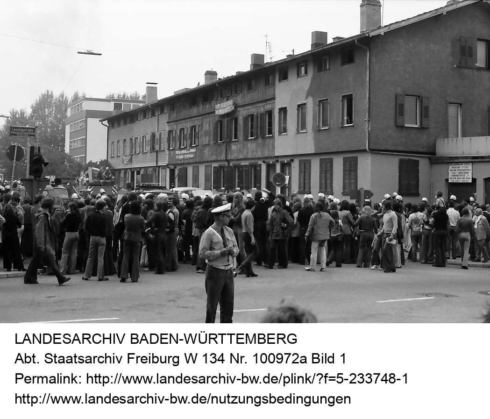
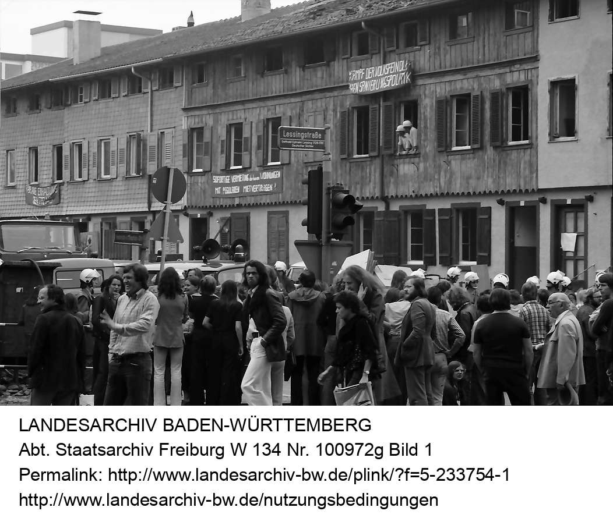

# **Hallo zusammen!**

Wir, die Bewohner:Innen der Freiau99, freuen uns dass ihr euren Weg auf unsere Website gefunden habt.

\
Schaut euch um und informiert euch - wir sind dankbar für euer Interesse, Anmerkungen und Eure Unterstützung!

Im “Archiv” könnt ihr euch durch bereits versendete Versionen unserer Newsletter klicken und euch so ein bisschen zur Chronologie des Projekts einlesen.

::::::: {#carouselround .carousel .slide data-bs-ride="carousel" data-bs-interval="6000"}
:::::: carousel-inner
::: {.carousel-item .active}

:::

::: carousel-item

:::

::: carousel-item

:::
::::::

<!-- CONTROLS (WICHTIG: KEINE WRAPPER!) -->

<button class="carousel-control-prev" 
        type="button" 
        data-bs-target="#carouselround" 
        data-bs-slide="prev">

  <span class="carousel-control-prev-icon"></span>

</button>

<button class="carousel-control-next" 
        type="button" 
        data-bs-target="#carouselround" 
        data-bs-slide="next">

  <span class="carousel-control-next-icon"></span>

</button>
:::::::

# Über uns

Wir, die Bewohner:Innen der Freiau 99, sind 9 junge Menschen die in unserer gemeinsamen Zeit nicht nur eine enge Bindung zueinander, sondern auch zu dem Haus aufgebaut haben. Als bunte Truppe und Gruppe von kreativen Köpfen wollen wir uns unseren Wohnraum beibehalten und unseren Vorstellungen nach nutzen.

Im Frühling 2019, als unser Vermieter uns mitteilte, dass er das Haus verkaufen will, sahen wir uns mit einem Thema konfrontiert, das hochaktuell ist und immer weiter an Brisanz zunimmt: Der Erhalt bezahlbaren Wohnraums angesichts des immer stärker werdenden Einflusses des Immobilienmarktes.

Mit dem Hausprojekt Freiau99 tragen wir nun unseren Teil dazu bei, dass Freiburg auch in Zukunft noch die junge, dynamische und offene Stadt ist, die wir schätzen und leisten unseren Beitrag zu einem solidarischeren Wohnungsmarkt



# **Das Haus**

Die Freiaustraße 99, das hellblaue, dritte Haus der Reihe, ist eines der wenigen noch existierenden denkmalgeschützten Häuser einer ehemaligen Arbeiter:Innensiedlung am Rande des Wiehreviertels in Freiburg.


::: g-col-6
```{r}
#| label: Karte
#| include: true
#| echo: false
#| message: false
#| warning: false

library(leaflet)
library(sf)

Lat = 47.991401
Long = 7.837554
Name = "Freiau99"

df = data.frame(Lat, Long, Name)

f99 = st_as_sf(
  df,
  coords = c("Long", "Lat"),
  crs = 4326
)

leaflet(
  data = f99,
  height = 300, width = 400
) %>%
  addTiles() %>%
  addMarkers(
    popup = ~Name
  ) %>%
  setView(
    lng = Long,
    lat = Lat,
    zoom = 17
  )

```


Die Freiau 99 entstand 1870/71 als Teil einer Arbeiter:Innensiedlung. Damals bestand die Freiau aus zehn Häuserreihen mit jeweils fünf Häusern.

Durch den Bau des Autobahnzubringers im Jahr 1974 sollte durch die Freiausiedlung eine Schneise geschlagen werden. Dies stieß auf Widerstand - es kam zu Demonstrationen und Freiburgs ersten Hausbesetzungen. Jedoch konnten auch diese den Abriss nicht verhindern. Heute gibt es noch fünf Häuserreihen, welche seit 1986 unter Denkmalschutz stehen. Die Reihe mit der Freiau 99 befindet sich etwas abseits zwischen Bahnschienen, der Heinrich-von-Stephan-Straße und riesigen Bürogebäuden.

::::::: {#carouselhist .carousel .slide data-bs-ride="carousel" data-bs-interval="6000"}
:::::: carousel-inner
::: {.carousel-item .active}

:::

::: carousel-item

:::

::::::

<!-- CONTROLS (WICHTIG: KEINE WRAPPER!) -->

<button class="carousel-control-prev" 
        type="button" 
        data-bs-target="#carouselhist" 
        data-bs-slide="prev">

  <span class="carousel-control-prev-icon"></span>

</button>

<button class="carousel-control-next" 
        type="button" 
        data-bs-target="#carouselhist" 
        data-bs-slide="next">

  <span class="carousel-control-next-icon"></span>

</button>
:::::::

<figcaption class="caption">Die vorhergegangenen Bilder sind Fotografien von Willy Pragher, aufgenommen am 22. August 1974 bei der Demonstration in der Freiau-Siedlung.</figcaption>