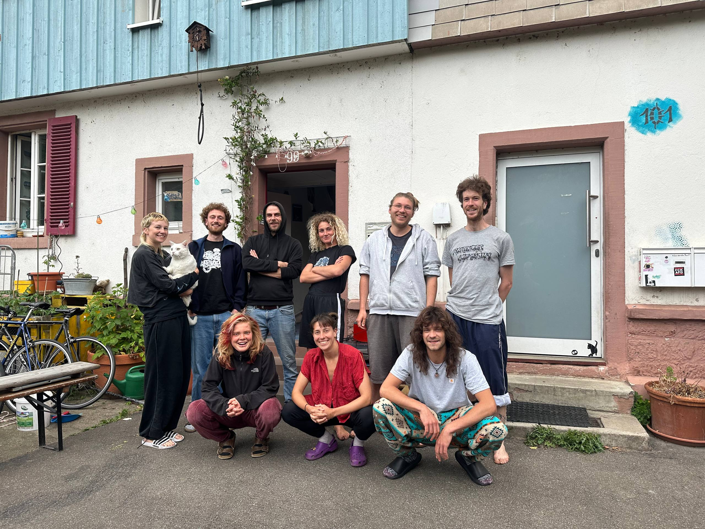
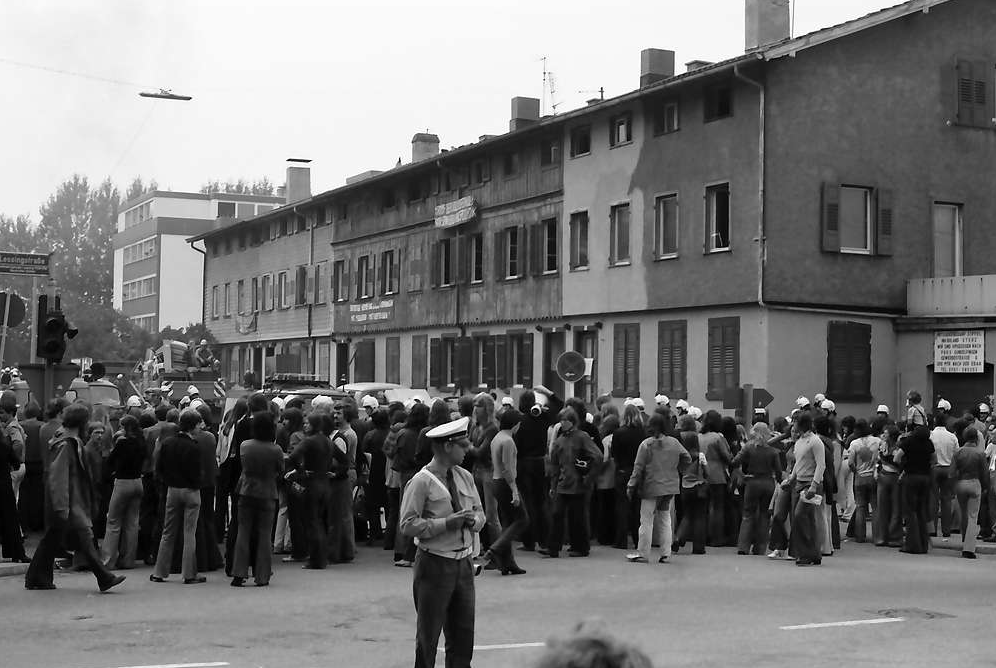
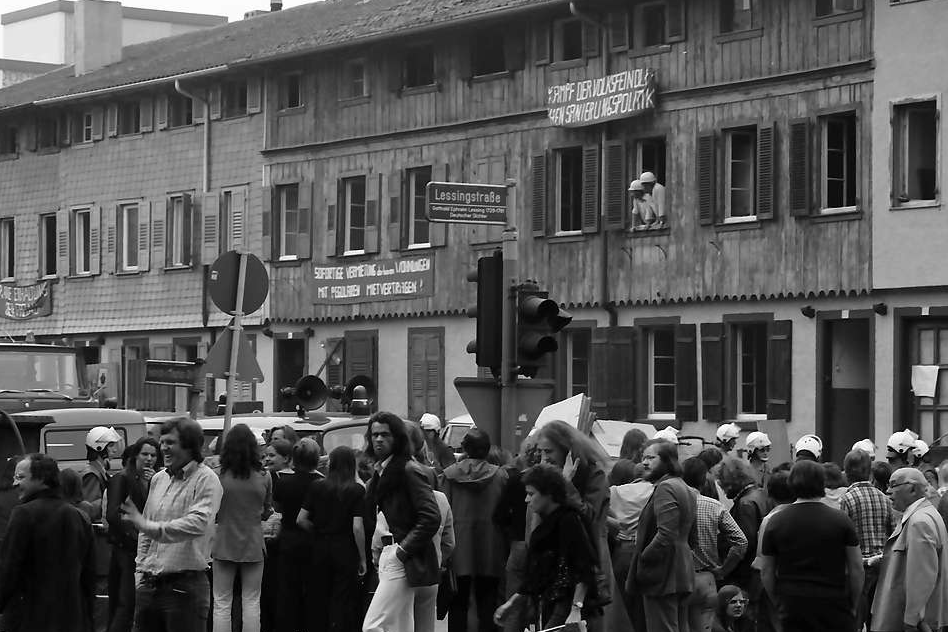

Wir, die Bewohner:innen der Freiau 99, sind neun junge Menschen, die im gemeinsamen Wohnen nicht nur eine enge Gemeinschaft, sondern auch eine starke Bindung zum Haus entwickelt haben.

Als Gruppe mit unterschiedlichen Hintergründen und Interessen gestalten wir unseren Wohnraum selbstbestimmt und solidarisch.

{fig-align="center"}

<figcaption class="caption">

Obere Reihe: Silia, Marcel, Raoul, Jules, Daniel, Elias\
Untere Reihe: Luka, Emilia, Can

</figcaption>

# **Das Haus**

Die Freiaustraße 99 ist das hellblaue dritte Haus einer ehemaligen Arbeiter:innensiedlung am Rand des Wiehreviertels in Freiburg. Es zählt zu den wenigen noch erhaltenen, denkmalgeschützten Gebäuden dieser Siedlung.

Die Siedlung entstand 1870/71 und umfasste ursprünglich zehn Häuserreihen mit je fünf Häusern.

Im Zuge des Autobahnbaus 1974 sollte ein Teil der Siedlung abgerissen werden. Dagegen formierte sich Widerstand – es kam zu Protesten und ersten Hausbesetzungen in Freiburg. Trotz dieser Bewegung wurden große Teile abgerissen.

Heute stehen noch fünf Häuserreihen unter Denkmalschutz. Die Freiau 99 liegt etwas abseits zwischen Bahngleisen, der Heinrich-von-Stephan-Straße und Bürogebäuden.

::::::::: grid
::: g-col-6
```{r}
#| label: Karte
#| include: false
#| echo: false
#| message: false
#| warning: false

library(leaflet)
library(sf)

Lat = 47.991401
Long = 7.837554
Name = "Freiau99"

df = data.frame(Lat, Long, Name)

f99 = st_as_sf(
  df,
  coords = c("Long", "Lat"),
  crs = 4326
)

leaflet(
  data = f99,
  height = "100%"
) %>%
  addTiles() %>%
  addMarkers(
    popup = ~Name
  ) %>%
  setView(
    lng = Long,
    lat = Lat,
    zoom = 17
  )

```
:::

::::::: g-col-6
:::::: {#carouselhist .carousel .slide data-bs-ride="carousel" data-bs-interval="6000"}
::::: carousel-inner
::: {.carousel-item .active}
{fig-align="center"}
:::

::: carousel-item
{fig-align="center"}
:::
:::::

<!-- CONTROLS (WICHTIG: KEINE WRAPPER!) -->

<button class="carousel-control-prev" type="button" data-bs-target="#carouselhist" data-bs-slide="prev">

</button>

<button class="carousel-control-next" type="button" data-bs-target="#carouselhist" data-bs-slide="next">

</button>
::::::

<figcaption class="caption">

Die historischen Fotos stammen von Willy Pragher und zeigen die Demonstrationen am 22. August 1974 im Zuge der Proteste gegen den Abriss der Siedlung.

</figcaption>
:::::::
:::::::::
